<div align="center">

# Digital Telco Product Activation Architecture

### From Product Idea to Activated Subscriber

**A vendor-neutral reference architecture for modern digital telecommunications**

Product Catalog · Product Order · Service Orchestration · SIM/eSIM · MSISDN · Resource Activation · Inventory

<br>

[](#)
[](https://www.tmforum.org/oda/open-apis/)
[](https://www.tmforum.org/oda/)
[](LICENSE)
[](#)

<br>

**Architecture & Research by Mohamed Salman**

</div>

---

## Executive Overview

Modern digital telecom products span multiple architectural domains.

A commercial proposition defined in a product catalog eventually needs to become an **activated and measurable subscriber service**, backed by service and network resources.

This reference architecture explores that end-to-end journey:

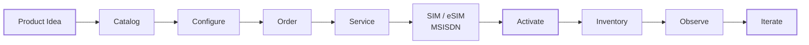

The architecture applies **TM Forum Open APIs and Open Digital Architecture (ODA) principles** while remaining implementation-neutral and vendor-neutral.

It focuses on the architectural boundary between:

> **Commercial Product Management → Digital BSS → Service Orchestration → Subscriber Resources → Network Activation**

The goal is not simply to demonstrate API integration.

The goal is to explore how a telecommunications platform can make the journey from **product idea to active subscriber composable, observable, reusable and faster to evolve.**

---

## Architecture Scope

| Domain | Key Capabilities |
|---|---|
| **Product** | Catalog, configuration, ordering, product inventory |
| **Service** | Service ordering, orchestration, service inventory |
| **Subscriber Resources** | SIM, eSIM, ICCID, IMSI, MSISDN lifecycle |
| **Resource** | Resource ordering, allocation and inventory |
| **Activation** | Provisioning and resource activation |
| **Integration** | APIs, events and lifecycle orchestration |
| **Operations** | Observability, reconciliation and failure handling |

---

## Standards Foundation

This project draws on:

**TM Forum Open Digital Architecture (ODA)**  
**TM Forum Open APIs**  
**TM Forum Information Framework (SID) concepts**  
**API-first architecture**  
**Event-driven architecture**  
**Cloud-native architecture**

> **Standards boundary:** TM Forum specifications remain authoritative. Project-specific components, lifecycle models and design decisions are explicitly identified as reference architecture concepts rather than official TM Forum definitions.

---

## Why This Project?


# Digital Telco Product Activation Architecture

> **From Product Idea to Activated Subscriber**

A vendor-neutral reference architecture demonstrating how a digital telecom product can move from **product definition and ordering to service orchestration, SIM/eSIM and MSISDN resource management, activation, and inventory**.

The architecture uses **TM Forum Open APIs and Open Digital Architecture (ODA) principles** as its standards foundation while introducing implementation-neutral patterns for subscriber resource orchestration.

---

## Why This Project?

Launching a telecom product is not only a catalog or application problem.

A commercial proposition eventually has to become a working subscriber service.

That journey can cross multiple domains:

**Product → Order → Service → Resource → Activation → Inventory**

This repository explores how those domains can be connected through standardized APIs and loosely coupled architectural components.

The objective is to demonstrate a reusable architecture where new digital products can move from concept to activation without creating a new point-to-point integration landscape for every product launch.

---

## Architecture Principles

The reference architecture follows several principles:

- **API-first** — capabilities are exposed through well-defined APIs.
- **Standards-aligned** — TM Forum Open APIs are used where applicable.
- **Domain-oriented** — product, service, and resource responsibilities remain separated.
- **Composable** — capabilities can evolve independently.
- **Event-driven** — lifecycle changes can be propagated asynchronously.
- **Cloud-native ready** — components can be containerized and independently deployed.
- **Vendor-neutral** — no dependency on a specific BSS, OSS, network, or cloud vendor.
- **Lifecycle-aware** — activation is treated as part of a wider subscriber lifecycle rather than a single provisioning transaction.

---

# 1. Product-to-Network Architecture

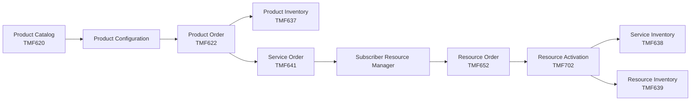

The architecture separates three important concerns:

### Product Layer

Defines **what the customer buys**.

Examples:

- Mobile plans
- Data packages
- Add-ons
- Roaming products
- Digital services

### Service Layer

Defines **what services must exist** to deliver the purchased product.

Examples:

- Mobile connectivity
- Voice service
- Data service
- Messaging
- Roaming enablement

### Resource Layer

Defines **which technical resources are required**.

Examples:

- SIM
- eSIM
- ICCID
- IMSI
- MSISDN
- Network resources

---

# 2. Architecture at a Glance

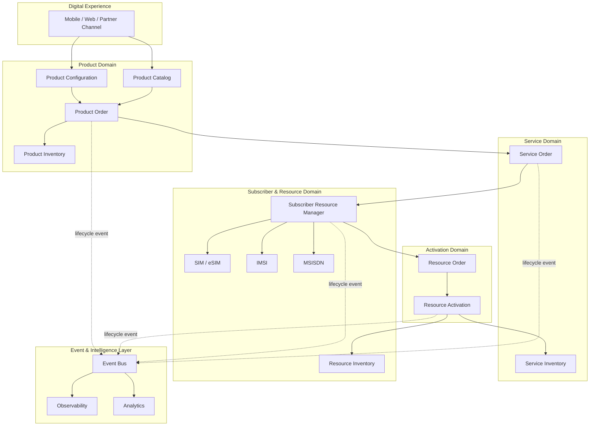

---

# 3. Core Lifecycle

The central lifecycle modeled by this project is:

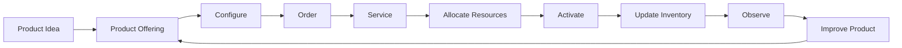

This creates a continuous loop between **product strategy and operational execution**.

---

# 4. TM Forum Open API Mapping

The initial architecture focuses on the following TM Forum Open APIs:

| API | Capability | Role in Architecture |
|---|---|---|
| **TMF620** | Product Catalog Management | Product offerings, specifications and catalog |
| **TMF622** | Product Ordering Management | Capture and manage product orders |
| **TMF637** | Product Inventory Management | Track customer product instances |
| **TMF641** | Service Ordering Management | Orchestrate service requests |
| **TMF638** | Service Inventory Management | Maintain instantiated services |
| **TMF652** | Resource Order Management | Manage resource orders |
| **TMF702** | Resource Activation Management | Activate technical resources |
| **TMF639** | Resource Inventory Management | Maintain resource state and relationships |

> **Important:** This repository does not redefine TM Forum specifications.  
> The official TM Forum specifications remain the authoritative source.

---

# 5. Subscriber Resource Manager

A central architectural concept introduced by this reference implementation is the:

## Subscriber Resource Manager

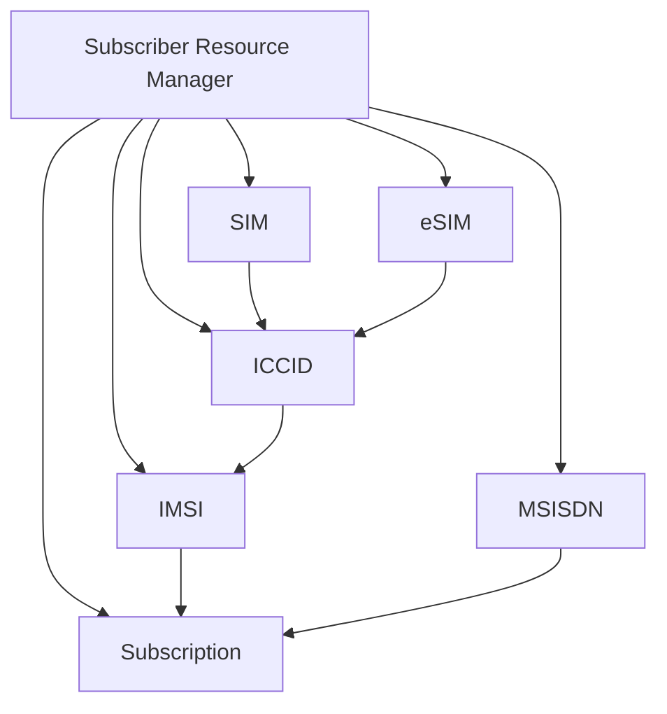

Its purpose is to coordinate subscriber-related resources without coupling the commercial product layer directly to network-specific provisioning systems.

Conceptually, it manages relationships such as:

```text
Subscription
    │
    ├── MSISDN
    │
    ├── IMSI
    │
    └── SIM / eSIM
          │
          └── ICCID
```

> **Note**
>
> `Subscriber Resource Manager` is an architectural abstraction defined by this project.
> It is **not presented as an official TM Forum component**.

---

# 6. Digital eSIM Onboarding

The first reference use case is a digital eSIM onboarding journey.

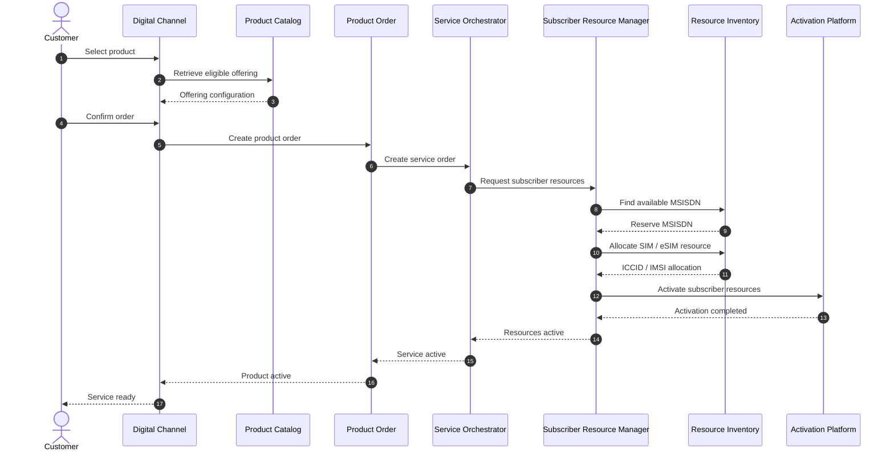

---

# 7. SIM / eSIM Lifecycle

SIM and eSIM resources should be managed as lifecycle entities rather than static database records.

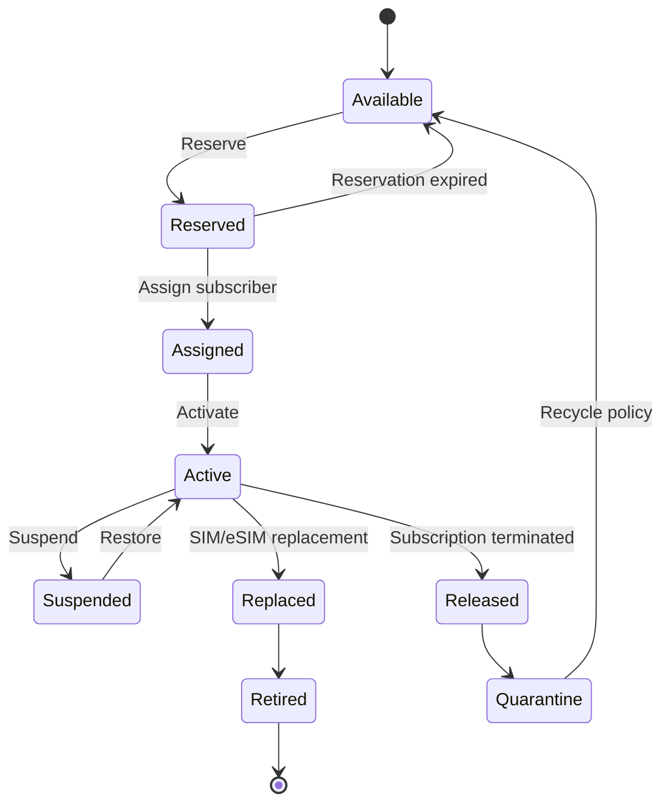

The exact operational lifecycle can differ between operators and platforms; this model is therefore intentionally implementation-neutral.

---

# 8. MSISDN Lifecycle

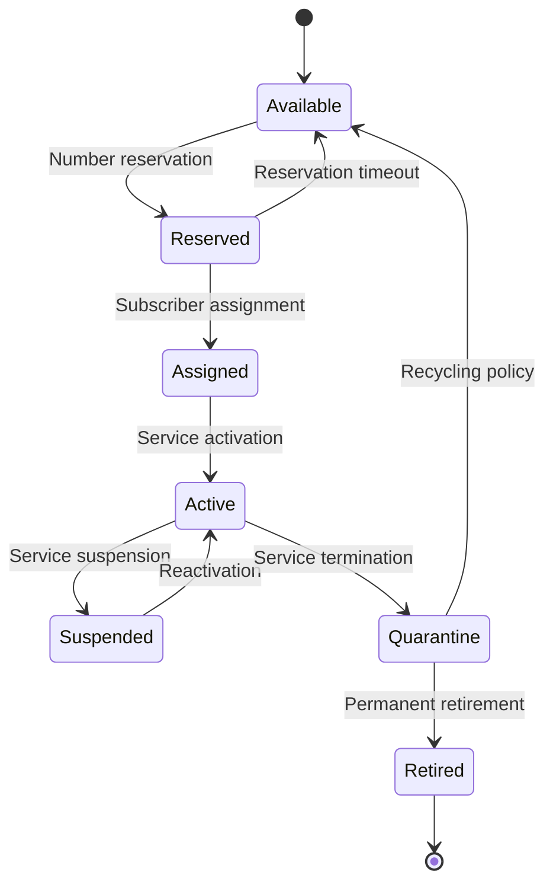

The architecture deliberately separates:

**number availability**

from

**number assignment**

from

**service activation**.

This allows resource lifecycle policies to evolve independently from commercial product logic.

---

# 9. Product-to-Resource Traceability

A key architecture objective is maintaining traceability across layers.

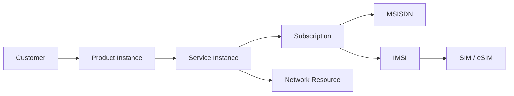

This makes questions such as the following easier to answer:

- Which resources support this customer product?
- Which subscription owns this MSISDN?
- Which service is affected by a resource failure?
- Which products depend on a particular service?
- What must change when a subscriber replaces a SIM?
- Which resources should be released after termination?

---

# 10. Event-Driven Lifecycle

Synchronous APIs alone are not enough for every lifecycle interaction.

The architecture therefore supports asynchronous domain events.

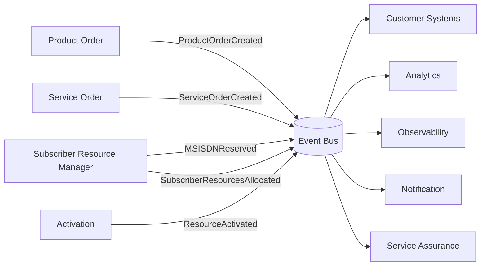

Example domain events:

```text
ProductOrderCreated
ProductOrderCompleted
ServiceOrderCreated
ServiceActivated
MSISDNReserved
MSISDNAssigned
SIMAllocated
ESIMAllocated
SubscriberResourcesAllocated
ResourceActivationRequested
ResourceActivated
ResourceActivationFailed
SubscriptionSuspended
SubscriptionTerminated
```

The event names above are **reference implementation concepts**, not TM Forum event names unless explicitly mapped to a corresponding TM Forum specification.

---

# 11. API-First Architecture

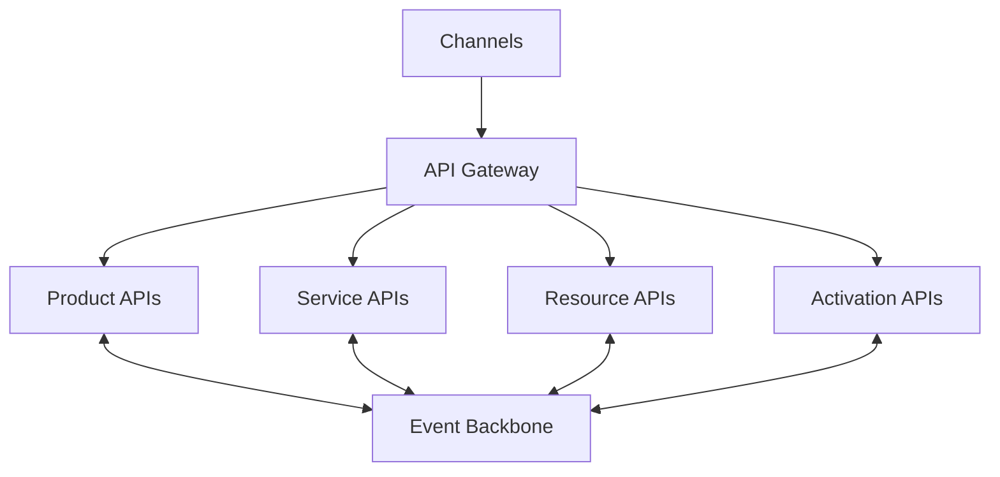

The gateway is an access and policy layer.

It should not become the central business orchestrator.

Business orchestration remains inside the appropriate domain services.

---

# 12. Conceptual Domain Model

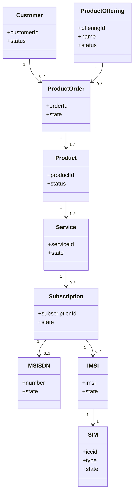

This model is conceptual and intentionally simplified.

It should not be interpreted as a replacement for the TM Forum Information Framework (SID).

---

# 13. Separation of Concerns

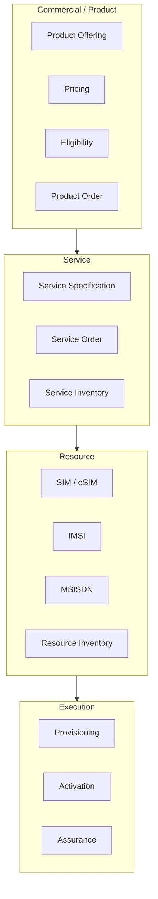

A major objective is preventing commercial product logic from becoming tightly coupled to underlying network technologies.

---

# 14. Reference Repository Structure

```text
Digital-Telco-Product-Activation-Architecture/
│
├── README.md
├── LICENSE
│
├── docs/
│   ├── architecture.md
│   ├── product-lifecycle.md
│   ├── esim-lifecycle.md
│   ├── msisdn-lifecycle.md
│   └── design-decisions/
│
├── diagrams/
│   ├── business/
│   ├── solution/
│   ├── sequence/
│   └── deployment/
│
├── components/
│   ├── product-catalog/
│   ├── product-order/
│   ├── product-inventory/
│   ├── service-order/
│   ├── subscriber-resource-manager/
│   ├── resource-order/
│   └── activation/
│
├── api/
│   ├── tmf620/
│   ├── tmf622/
│   ├── tmf637/
│   ├── tmf641/
│   ├── tmf638/
│   ├── tmf639/
│   ├── tmf652/
│   └── tmf702/
│
├── examples/
│   ├── esim-onboarding/
│   ├── prepaid-plan/
│   ├── number-allocation/
│   ├── plan-change/
│   └── sim-replacement/
│
└── deployment/
    ├── docker/
    └── kubernetes/
```

---

# 15. Reference Use Cases

The project will progressively demonstrate several product lifecycle scenarios.

| Use Case | Description |
|---|---|
| **Digital eSIM onboarding** | Product purchase through subscriber activation |
| **New SIM activation** | Physical SIM allocation and activation |
| **MSISDN allocation** | Number reservation, assignment and activation |
| **SIM replacement** | Replace SIM while preserving subscription context |
| **Plan change** | Modify an existing commercial product |
| **Add-on activation** | Activate an additional service against an existing subscription |
| **Service suspension** | Temporarily suspend subscriber services |
| **Subscription termination** | Deactivate services and release eligible resources |

---

# 16. Architecture Decision Records

Important architectural decisions will be maintained as ADRs.

Initial ADRs:

```text
ADR-001  Separate Product, Service and Resource Domains
ADR-002  Introduce Subscriber Resource Manager
ADR-003  API-First Integration
ADR-004  Event-Driven Lifecycle Propagation
ADR-005  Separate Resource Allocation from Activation
ADR-006  Maintain Product-to-Resource Traceability
ADR-007  Keep Network Provisioning Behind Domain Boundaries
```

This makes architectural reasoning visible rather than documenting only the final diagrams.

---

# 17. Non-Functional Architecture

The reference architecture will consider:

### Scalability

Stateless services should scale horizontally where practical.

### Resilience

Activation workflows must tolerate downstream failures and asynchronous completion.

### Idempotency

Repeated activation or ordering requests must not unintentionally create duplicate resources.

### Observability

A transaction should be traceable across:

```text
Product Order
    ↓
Service Order
    ↓
Resource Allocation
    ↓
Activation
    ↓
Inventory
```

### Security

The implementation should support:

- Authentication
- Authorization
- API scopes
- Service-to-service identity
- Audit trails
- Secrets management
- Encryption in transit
- Least-privilege access

### Data Consistency

Long-running telecom workflows should avoid assuming that all participating systems can commit within a single distributed transaction.

---

# 18. Failure & Compensation

Activation is not always successful.

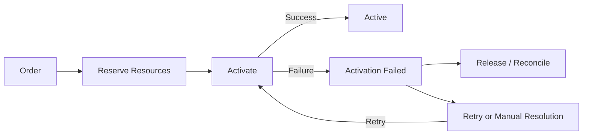

This project will explore compensation and reconciliation patterns rather than assuming every provisioning request succeeds synchronously.

---

# 19. Target Deployment Model

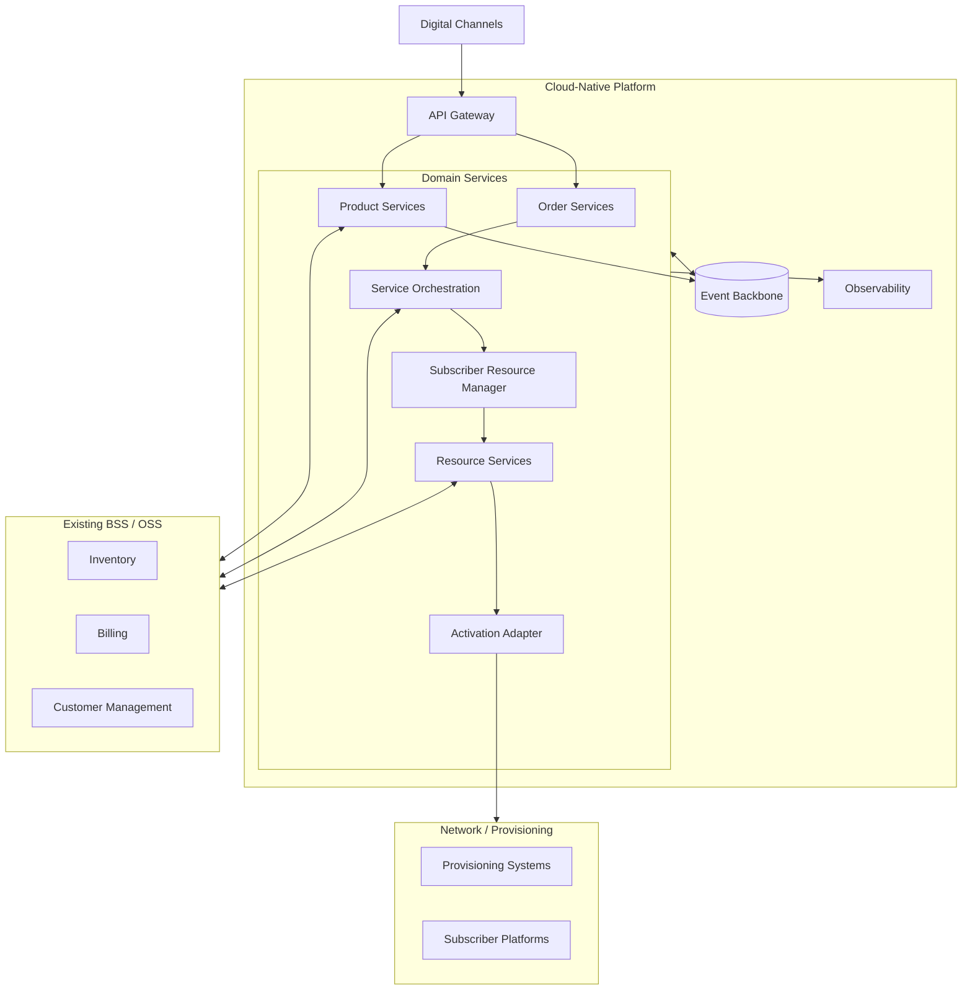

The design intentionally allows integration with existing BSS/OSS environments instead of requiring a complete platform replacement.

---

# 20. Roadmap

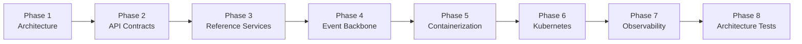

### Phase 1 — Architecture

- Domain boundaries
- Product-to-resource lifecycle
- eSIM onboarding
- MSISDN lifecycle
- Architecture Decision Records

### Phase 2 — API Contracts

Introduce API contracts and mappings for the selected TM Forum Open APIs.

### Phase 3 — Reference Implementation

Build lightweight services demonstrating the architecture.

### Phase 4 — Event-Driven Integration

Introduce lifecycle events and asynchronous orchestration.

### Phase 5 — Containerization

Package reference services using containers.

### Phase 6 — Kubernetes

Demonstrate cloud-native deployment.

### Phase 7 — Observability

Add distributed tracing, metrics and lifecycle correlation.

### Phase 8 — Architecture Validation

Introduce automated API and architecture conformance checks.

---

# 21. What This Repository Is — and Is Not

### It is

- A reference architecture
- A learning and experimentation environment
- A telecom product-to-activation architecture
- A TM Forum Open API integration study
- A digital BSS/OSS architecture showcase
- A foundation for reference implementations

### It is not

- A commercial BSS
- A production-ready provisioning platform
- An official TM Forum implementation
- A replacement for TM Forum specifications
- A replacement for an operator's inventory or provisioning systems
- A claim of TM Forum certification

---

# 22. Standards & References

This project studies and references TM Forum Open APIs including:

- TMF620 — Product Catalog Management
- TMF622 — Product Ordering Management
- TMF637 — Product Inventory Management
- TMF641 — Service Ordering Management
- TMF638 — Service Inventory Management
- TMF639 — Resource Inventory Management
- TMF652 — Resource Order Management
- TMF702 — Resource Activation Management

Official TM Forum Open API specifications should always be treated as the authoritative source.

TM Forum Open API GitHub organization:

https://github.com/tmforum-apis

TM Forum Open API directory:

https://www.tmforum.org/oda/open-apis/directory/

---

# 23. Design Goal

The long-term architectural goal can be summarized in one flow:

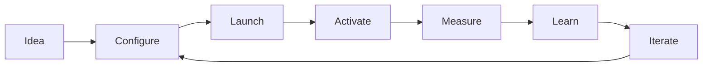

> **The objective is not simply to make activation faster.**
>
> **The objective is to make the entire path from product idea to active subscriber composable, observable and reusable.**

---

## Contributing

Contributions, architecture discussions, API mappings and implementation ideas are welcome.

Please keep contributions:

- Vendor-neutral
- Standards-aware
- Architecture-focused
- Clearly separated between standardized behavior and project-specific design decisions

---

## License

This project is licensed under the **Apache License 2.0**.

Third-party standards, specifications, trademarks and referenced materials remain subject to their respective owners and licenses.

---

## Disclaimer

This is an independent reference architecture and is not an official TM Forum project.

TM Forum, ODA, SID and TM Forum Open API names are referenced for architectural and interoperability purposes. Refer to the official TM Forum documentation for authoritative specifications.


---

## Author

**Mohamed Salman**  
Solution & Enterprise Architecture · Digital Platforms · Telecommunications · Data & AI

Architecture interests include digital BSS/OSS, TM Forum ODA, API architecture, cloud-native platforms, event-driven systems and emerging telecom technologies.

---

## License

Licensed under the **Apache License 2.0**.

This is an independent reference architecture. TM Forum, ODA, SID and TM Forum Open API names are referenced for architecture and interoperability purposes. Official TM Forum specifications remain the authoritative source.

---

<div align="center">

**Digital Telco Product Activation Architecture**

*From product idea to activated subscriber.*

Architecture & Research · **Mohamed Salman**

</div>
