# Digital Telco Product Activation — Reference Architecture

> **Architecture & Research by Mohamed Salman**  
> Vendor-neutral · TM Forum Open API aligned · ODA-inspired · API-first · Event-driven

---

## 1. Purpose

This document defines the solution architecture for a digital telecommunications product activation platform.

The architecture connects the commercial product lifecycle with service orchestration, subscriber resource management, activation, and inventory.

The core architectural journey is:

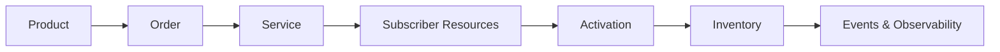

The architecture is designed around a simple principle:

> **A commercial product should evolve independently from the technical complexity required to activate it.**

---

# 2. Architecture Goals

The reference architecture aims to provide:

- Clear separation between **Product, Service and Resource domains**
- API-first interoperability
- TM Forum Open API alignment where applicable
- Independent SIM/eSIM and MSISDN lifecycle management
- Product-to-resource traceability
- Event-driven lifecycle propagation
- Idempotent activation workflows
- Failure recovery and reconciliation
- Cloud-native deployment capability
- End-to-end observability
- Vendor-neutral integration boundaries

---

# 3. System Context

At the highest level, the platform sits between digital engagement channels and existing BSS/OSS/network capabilities.

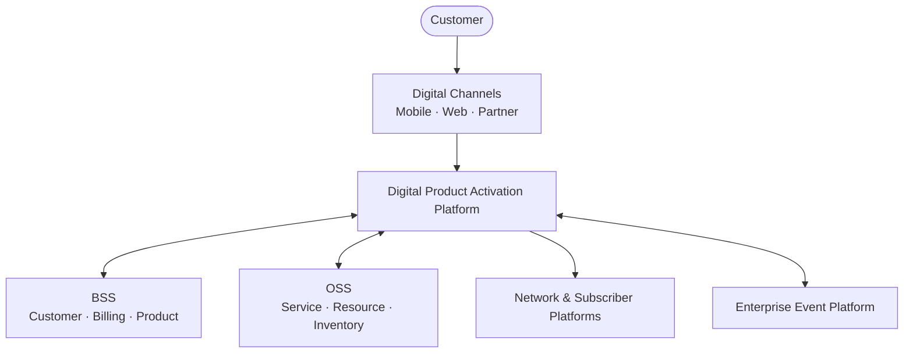

The platform does **not** require replacement of existing BSS or OSS capabilities.

Instead, it provides standardized domain boundaries and orchestration between commercial intent and technical execution.

---

# 4. Business-to-Technology View

The architecture translates a commercial proposition progressively into technical execution.

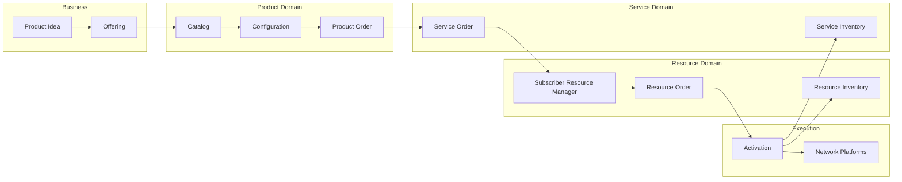

This separation allows a commercial product to change without embedding network-specific implementation logic into the product domain.

---

# 5. Domain Architecture

The solution is divided into bounded architectural domains.

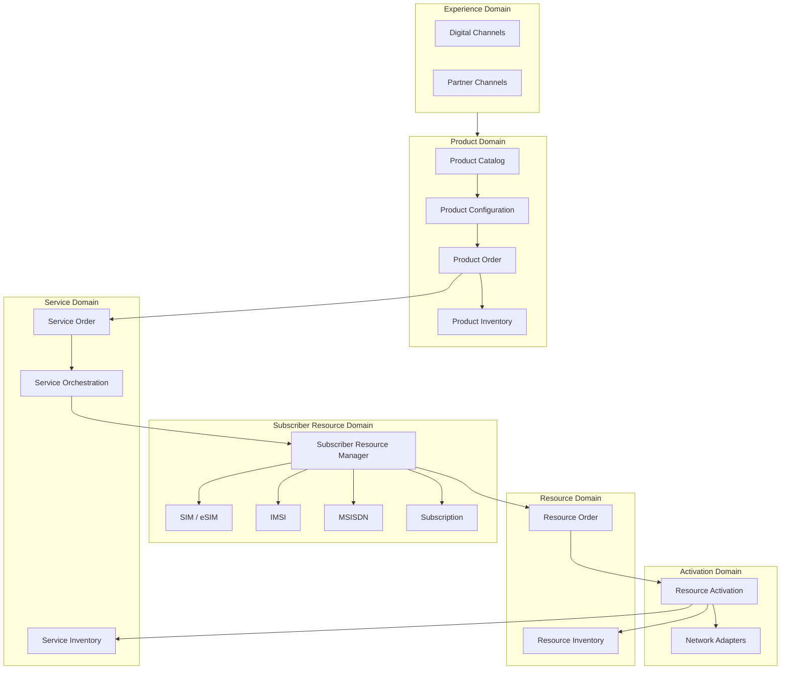

---

# 6. Domain Responsibilities

| Domain | Responsibility |
|---|---|
| **Experience** | Customer and partner interaction |
| **Product** | What is commercially offered and purchased |
| **Service** | What operational service must be instantiated |
| **Subscriber Resource** | Subscriber identity and number resource coordination |
| **Resource** | Technical resource ordering and inventory |
| **Activation** | Execution against provisioning/network platforms |
| **Event** | Asynchronous lifecycle propagation |
| **Observability** | Cross-domain operational visibility |

The boundaries are intentional.

For example:

**Product Order** should not directly provision a SIM.

Instead:

```text
Product Order
     ↓
Service Order
     ↓
Subscriber Resource Manager
     ↓
Resource / Activation
```

---

# 7. TM Forum API Alignment

The reference architecture maps relevant capabilities to TM Forum Open APIs.

| Architecture Capability | TM Forum API |
|---|---|
| Product Catalog | TMF620 |
| Product Order | TMF622 |
| Product Inventory | TMF637 |
| Service Order | TMF641 |
| Service Inventory | TMF638 |
| Resource Inventory | TMF639 |
| Resource Order | TMF652 |
| Resource Activation | TMF702 |

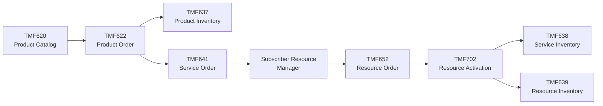

> **Standards boundary**
>
> `Subscriber Resource Manager` is a project-specific architectural abstraction.
>
> It is not presented as an official TM Forum component or API.

---

# 8. Subscriber Resource Manager

The **Subscriber Resource Manager (SRM)** isolates subscriber-resource complexity from commercial product logic.

Its conceptual responsibility includes coordination of:

- SIM
- eSIM
- ICCID
- IMSI
- MSISDN
- Subscription relationships
- Reservation
- Assignment
- Release
- Replacement
- Lifecycle state

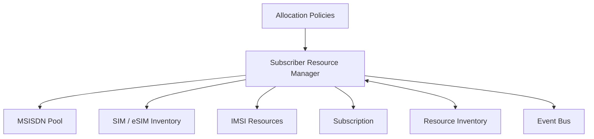

This prevents channels, product-order systems and service-order systems from directly implementing SIM/MSISDN allocation logic.

---

# 9. Subscriber Resource Model

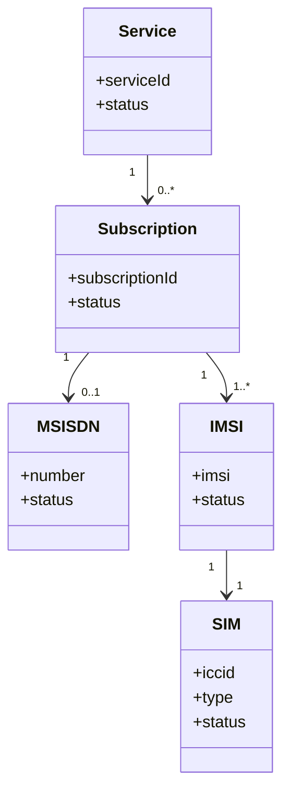

This is a **conceptual project model**, not a reproduction or replacement of the TM Forum Information Framework (SID).

---

# 10. End-to-End Activation

A typical digital subscription activation follows this sequence.

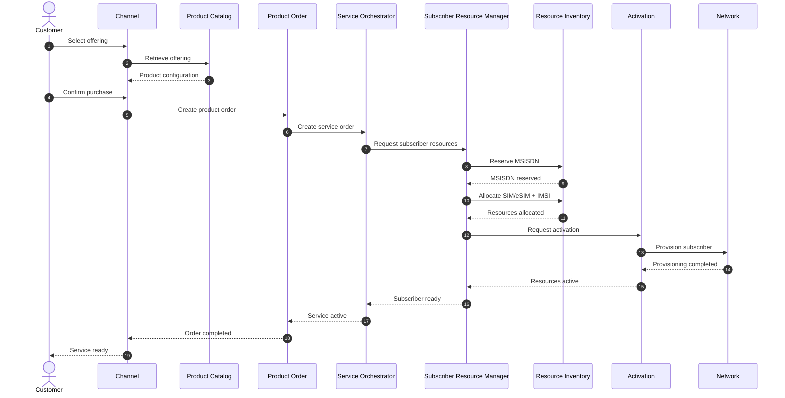

---

# 11. Resource Allocation vs Activation

Allocation and activation are deliberately separated.


### Allocation

Answers:

> **Which resource belongs to this subscription?**

Examples:

- reserve MSISDN
- allocate ICCID
- associate IMSI
- create resource relationships

### Activation

Answers:

> **Is that resource operational?**

Examples:

- subscriber provisioning
- network activation
- policy provisioning
- service enablement

Keeping the two concerns separate improves failure handling and reconciliation.

---

# 12. Event Architecture

Lifecycle state changes are propagated asynchronously where appropriate.

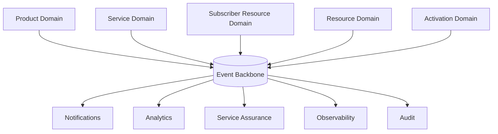

Example project-level domain events include:

```text
ProductOrderCreated
ProductOrderCompleted

ServiceOrderCreated
ServiceActivated

MSISDNReserved
MSISDNAssigned

SIMAllocated
ESIMAllocated

SubscriberResourcesAllocated

ResourceActivationRequested
ResourceActivated
ResourceActivationFailed

SubscriptionSuspended
SubscriptionTerminated
```

These names are illustrative project concepts unless explicitly mapped to standardized TM Forum events.

---

# 13. API Gateway Boundary

The API Gateway provides external API concerns but does not own domain orchestration.

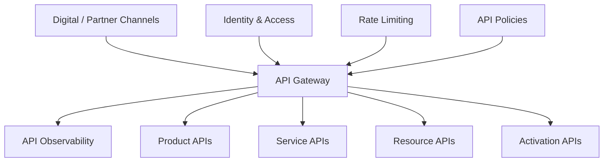

The gateway may provide:

- Authentication
- Authorization enforcement
- Routing
- Rate limiting
- API version routing
- Request validation
- Correlation identifiers
- API telemetry

Business workflow logic remains within domain services.

---

# 14. Orchestration Pattern

Telecom activation frequently involves long-running workflows.

A distributed ACID transaction across all systems is therefore avoided.

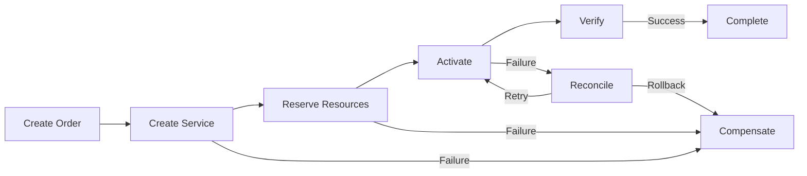

This resembles a **Saga-style orchestration approach** for long-running transactions.

---

# 15. Idempotency

Activation and ordering operations must tolerate retries.

Conceptually:

```text
Request
   │
   ▼
Idempotency Key
   │
   ├── Existing Result ──► Return Previous Result
   │
   └── New Request ──────► Execute Operation
```

Typical candidates include:

```text
POST /productOrders
POST /serviceOrders
POST /resourceReservations
POST /activations
```

A repeated network timeout must not accidentally create another subscription, number assignment, or activation.

---

# 16. Failure Architecture

Failure is treated as a normal architectural state.

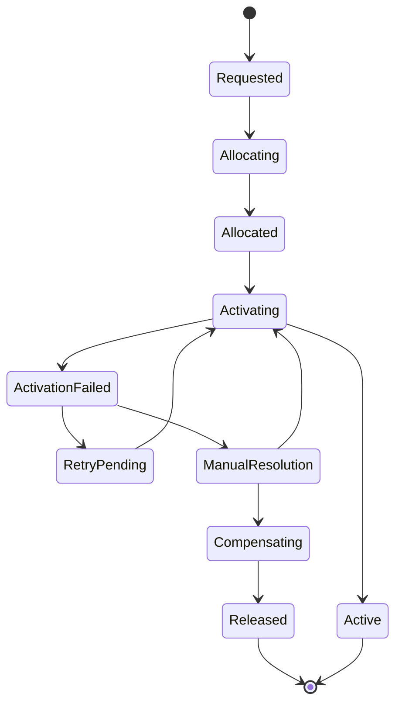

Examples of failure scenarios:

- MSISDN reservation timeout
- SIM resource unavailable
- activation platform unavailable
- downstream network timeout
- partial provisioning
- inventory update failure
- event publication failure

---

# 17. Observability Architecture

Every lifecycle transaction should carry a correlation identifier across domains.

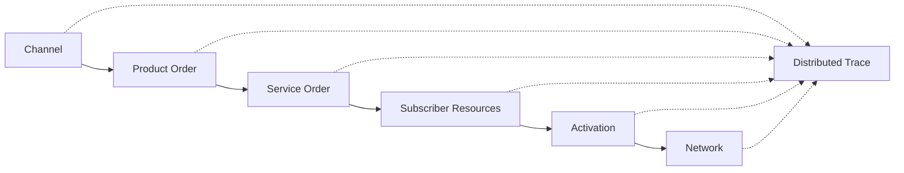

A single business transaction should ideally be traceable as:

```text
Correlation ID
      │
      ├── Product Order
      ├── Service Order
      ├── Resource Reservation
      ├── Activation Request
      ├── Network Transaction
      └── Inventory Update
```

Core telemetry includes:

- logs
- metrics
- distributed traces
- lifecycle events
- API latency
- provisioning latency
- activation success/failure rate
- resource allocation failures
- reconciliation backlog

---

# 18. Security Architecture

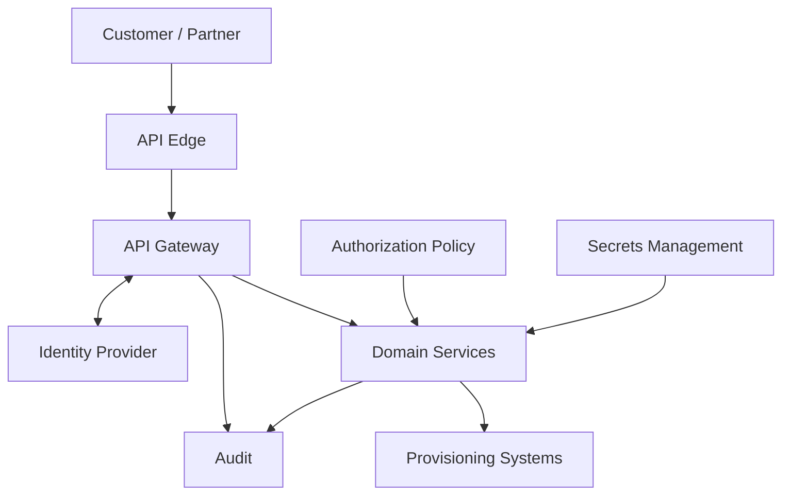

Security principles include:

- OAuth/OIDC where applicable
- scoped API authorization
- service-to-service identity
- least privilege
- encrypted transport
- secret isolation
- audit logging
- separation between external and internal APIs
- protection of subscriber identifiers
- controlled access to provisioning interfaces

---

# 19. Deployment Architecture

The logical architecture can be deployed using cloud-native infrastructure without coupling the design to a specific cloud provider.

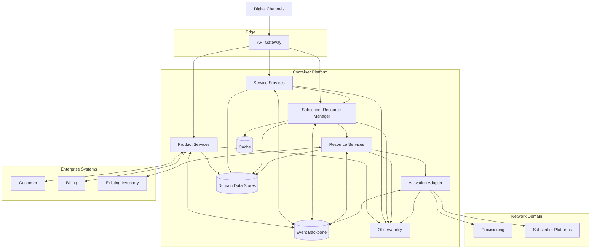

---

# 20. Logical Component Model

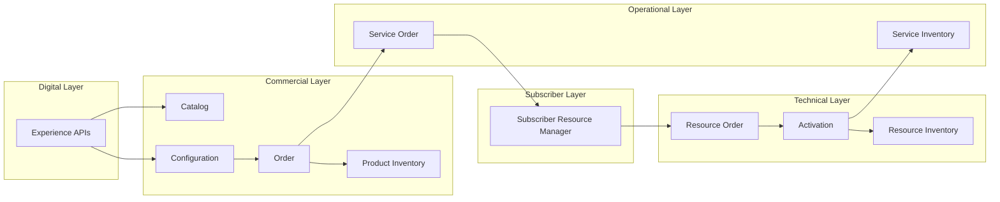

---

# 21. Product-to-Resource Traceability

The architecture preserves relationships across layers.

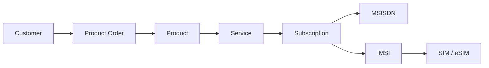

This supports operational questions such as:

- Which resources support this product?
- Which subscription owns this number?
- Which service depends on this resource?
- What must be changed during SIM replacement?
- Which resources must be released after termination?

---

# 22. Architecture Principles

The architecture follows these principles:

### 1. Product is not Service

Commercial intent and operational realization are separate concerns.

### 2. Service is not Resource

A service describes operational capability; resources provide the technical realization.

### 3. Allocation is not Activation

Owning a resource does not mean it is operational.

### 4. APIs define boundaries

Domain APIs expose capabilities without leaking internal implementation.

### 5. Events communicate lifecycle change

Events reduce unnecessary synchronous coupling.

### 6. Failure is expected

Retries, compensation and reconciliation are architectural requirements.

### 7. Every transaction is observable

Product-to-network execution should be traceable end-to-end.

### 8. Standards before proprietary integration

Standard interfaces are preferred where they satisfy the required capability.

### 9. Network complexity stays behind domain boundaries

Digital channels should not understand provisioning-system internals.

### 10. Architecture remains vendor-neutral

Products and infrastructure can change without redefining the core domain model.

---

# 23. Architecture Decision Records

The following ADRs will document major design decisions:

| ADR | Decision |
|---|---|
| ADR-001 | Separate Product, Service and Resource Domains |
| ADR-002 | Introduce Subscriber Resource Manager |
| ADR-003 | Adopt API-First Domain Boundaries |
| ADR-004 | Use Event-Driven Lifecycle Propagation |
| ADR-005 | Separate Resource Allocation from Activation |
| ADR-006 | Maintain Product-to-Resource Traceability |
| ADR-007 | Keep Provisioning Behind Activation Adapters |
| ADR-008 | Design Long-Running Workflows for Idempotency and Compensation |

---

# 24. Target Evolution

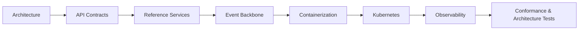

The repository intentionally evolves from **architecture first** toward executable reference components.

---

# 25. Architecture Boundary

This project is:

- a reference architecture
- vendor-neutral
- standards-aware
- implementation-oriented
- designed for experimentation and architecture discussion

It is not:

- a production BSS
- an official TM Forum implementation
- a TM Forum certification claim
- a replacement for SID
- a network provisioning product

Where TM Forum APIs or concepts are referenced, the official specifications remain authoritative.

---

# 26. Architectural North Star

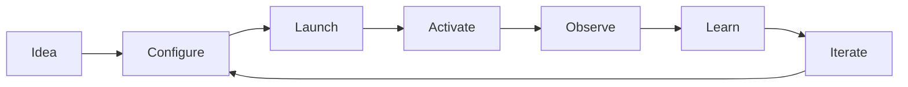

The architecture is ultimately designed around one objective:

> **Reduce the architectural distance between a product idea and an activated, observable subscriber service — without sacrificing domain separation, interoperability or operational control.**

---

## Author

**Mohamed Salman**

Solution & Enterprise Architecture · Digital Platforms · Telecommunications · Data & AI

---

## Related Documentation

- [Project Overview](../README.md)
- Product Lifecycle — `product-lifecycle.md`
- eSIM Lifecycle — `esim-lifecycle.md`
- MSISDN Lifecycle — `msisdn-lifecycle.md`
- TM Forum API Mapping — `tmf-api-mapping.md`
- SID Domain Model — `sid-domain-model.md`
- Architecture Decision Records — `design-decisions/`

---

**Digital Telco Product Activation Architecture**  
*From product idea to activated subscriber.*
