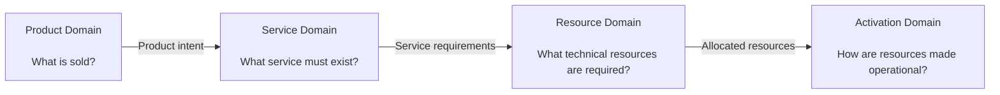
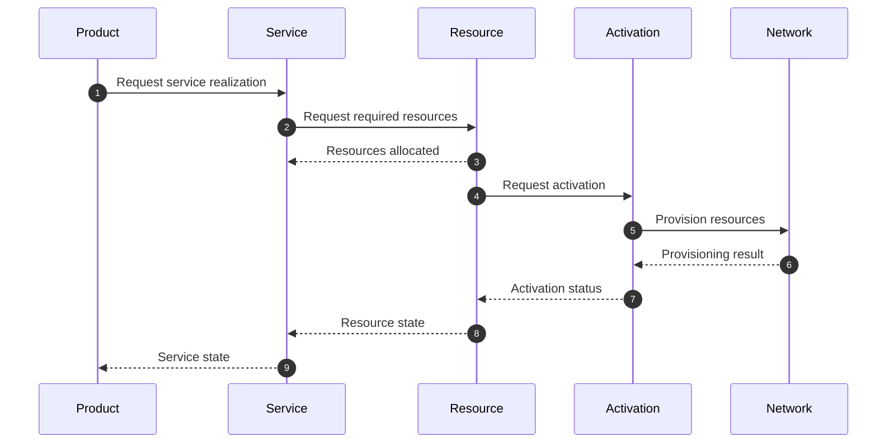
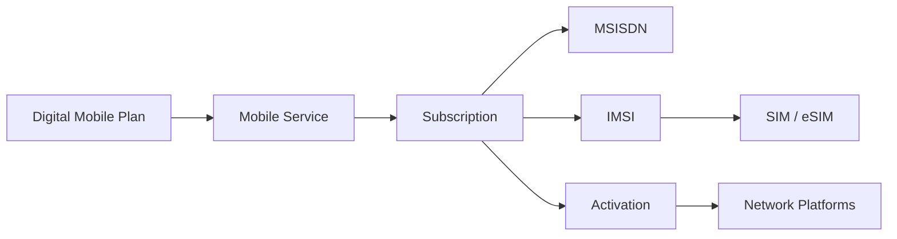
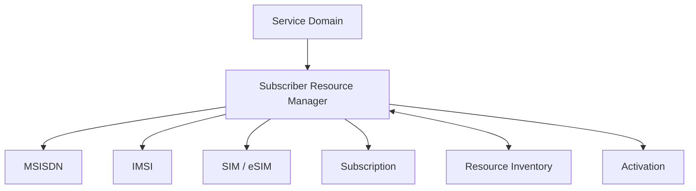
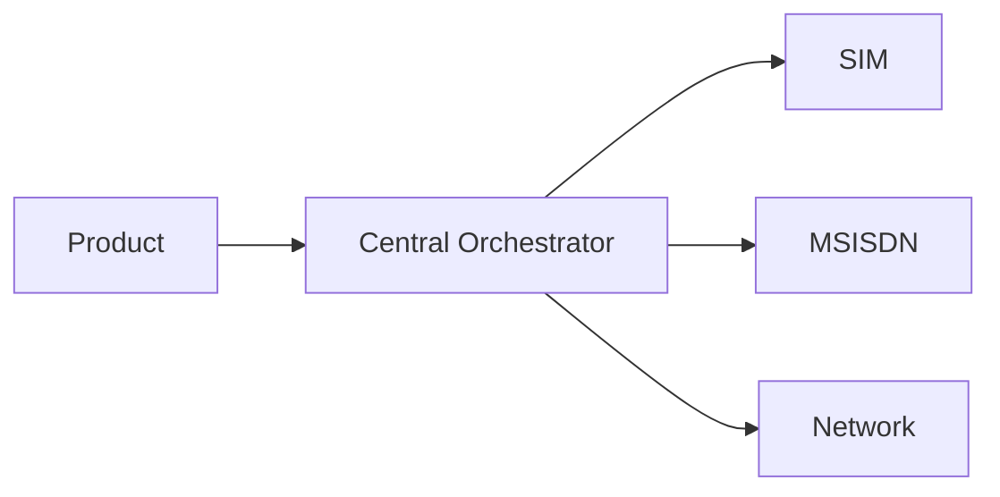
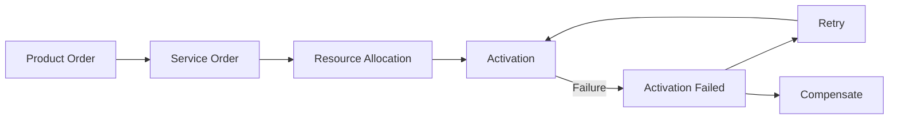
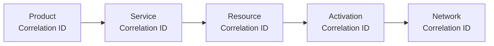
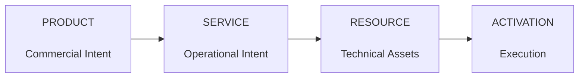

# ADR-001: Separate Product, Service and Resource Domains

**Status:** Accepted  
**Date:** 2026-09-21  
**Decision Type:** Architecture / Domain Boundaries  
**Author:** Mohamed Salman

---

## 1. Context

A digital telecommunications product crosses several fundamentally different concerns.

A customer may purchase a simple commercial proposition such as a mobile plan, but fulfilling that proposition can require:

- Product configuration
- Product ordering
- Service orchestration
- Subscription creation
- MSISDN reservation and assignment
- SIM/eSIM allocation
- IMSI association
- Resource activation
- Network provisioning
- Inventory synchronization

A common architectural failure is to collapse these responsibilities into a single product or provisioning domain.

This creates tight coupling between:

**Commercial Product Logic ↔ Service Logic ↔ Network Resources**

As a result, changes to a commercial proposition can require changes deep inside provisioning and network integrations.

This ADR establishes explicit boundaries between **Product, Service and Resource domains**.

---

## 2. Decision

The architecture SHALL model Product, Service and Resource as separate domains with explicit interfaces between them.



The primary architectural flow becomes:

```text
Product
   ↓
Service
   ↓
Resource
   ↓
Activation
```

No domain should require knowledge of the internal implementation of the next domain.

---

## 3. Domain Responsibilities

### Product Domain

The Product Domain represents **commercial intent**.

Responsibilities include:

- Product offerings
- Product specifications
- Product configuration
- Commercial eligibility
- Product ordering
- Product inventory
- Product lifecycle

Typical standards alignment:

- TMF620 — Product Catalog Management
- TMF622 — Product Ordering Management
- TMF637 — Product Inventory Management

The Product Domain answers:

> **What did the customer buy?**

---

### Service Domain

The Service Domain represents the **operational realization of the product**.

Responsibilities include:

- Service specification
- Service ordering
- Service decomposition
- Service orchestration
- Service lifecycle
- Service inventory

Typical standards alignment:

- TMF641 — Service Ordering Management
- TMF638 — Service Inventory Management

The Service Domain answers:

> **What operational service must exist to deliver the product?**

---

### Resource Domain

The Resource Domain represents the **technical resources used to realize services**.

Examples include:

- SIM
- eSIM
- ICCID
- IMSI
- MSISDN
- Network resources
- Resource relationships

Responsibilities include:

- Resource availability
- Reservation
- Allocation
- Assignment
- Resource ordering
- Resource inventory
- Release
- Lifecycle management

Typical standards alignment:

- TMF652 — Resource Order Management
- TMF639 — Resource Inventory Management

The Resource Domain answers:

> **Which technical resources are required to deliver the service?**

---

### Activation Domain

Activation represents the execution boundary between resource intent and operational network state.

Responsibilities include:

- Activation requests
- Provisioning adapters
- Network integration
- Activation state
- Retry handling
- Verification
- Reconciliation

Typical standards alignment:

- TMF702 — Resource Activation Management

The Activation Domain answers:

> **How does an allocated resource become operational?**

---

## 4. Domain Interaction



Each domain communicates through an explicit contract rather than accessing another domain's internal data or provisioning logic.

---

## 5. Example

Consider a customer purchasing a digital mobile product.

### Product View

```text
Unlimited Digital Plan
```

The Product Domain should not need to know how the underlying subscriber is provisioned.

### Service View

The product may require:

```text
Mobile Connectivity
Voice
Data
Messaging
```

### Resource View

Those services may require:

```text
Subscription
MSISDN
IMSI
SIM/eSIM
```

### Activation View

Those resources may need to be provisioned across underlying subscriber and network platforms.



The commercial product remains insulated from network-specific implementation.

---

## 6. Subscriber Resource Boundary

Subscriber-related resources introduce relationships that require coordinated lifecycle management.

For this reason, the reference architecture introduces a project-specific architectural abstraction:

**Subscriber Resource Manager**



The Subscriber Resource Manager coordinates subscriber-resource relationships while preserving the Product → Service → Resource separation.

> `Subscriber Resource Manager` is a reference architecture concept introduced by this project and is not presented as an official TM Forum component.

---

## 7. Rules

The following architectural rules apply.

### Rule 1 — Product does not provision resources

Invalid:

```text
Product Order → SIM Provisioning
```

Preferred:

```text
Product Order
      ↓
Service Order
      ↓
Resource Management
      ↓
Activation
```

---

### Rule 2 — Channels do not own resource logic

A mobile application, web channel or partner channel should not implement:

- MSISDN allocation
- IMSI assignment
- SIM provisioning
- network activation logic

These capabilities belong behind domain APIs.

---

### Rule 3 — Resource allocation and activation remain separate


An allocated resource is not necessarily an active resource.

---

### Rule 4 — Cross-domain communication uses contracts

Domains communicate through:

- APIs
- Commands
- Events

They should not rely on another domain's private database schema.

---

### Rule 5 — Lifecycle events may cross domains

Examples include:

```text
ProductOrderCreated
ServiceOrderCreated
MSISDNReserved
SubscriberResourcesAllocated
ResourceActivationRequested
ResourceActivated
ServiceActivated
ProductOrderCompleted
```

Event names in this repository are project-level examples unless explicitly mapped to a standardized event definition.

---

## 8. Alternatives Considered

### Alternative A — Single Product-to-Network Orchestrator



#### Rejected because

It creates a central component that accumulates:

- commercial rules
- service logic
- resource logic
- network-specific integration

Over time this risks becoming a tightly coupled orchestration monolith.

---

### Alternative B — Direct Product-to-Resource Integration

```text
Product Order
   │
   ├── SIM System
   ├── Number System
   ├── Inventory
   └── Provisioning
```

#### Rejected because

Product changes become dependent on technical resource implementations.

This increases coupling and makes product evolution harder.

---

### Alternative C — Domain Separation

```text
Product
   ↓
Service
   ↓
Resource
   ↓
Activation
```

#### Selected

It provides clearer ownership, better interoperability and stronger lifecycle isolation.

---

## 9. Consequences

### Positive

This decision provides:

- Clear domain ownership
- Reduced product-to-network coupling
- Independent lifecycle evolution
- Better API boundaries
- Improved testability
- Better product-to-resource traceability
- Easier integration with heterogeneous BSS/OSS environments
- More controlled network integration
- Stronger alignment with standards-based architecture

### Trade-offs

The architecture introduces:

- Additional service boundaries
- More API interactions
- Distributed state
- Eventual consistency
- More complex observability requirements
- Long-running workflow management
- Failure and compensation scenarios

These are accepted trade-offs because the architecture prioritizes evolvability and domain autonomy over short-term integration simplicity.

---

## 10. Failure Isolation

Domain separation should prevent a downstream failure from unnecessarily corrupting upstream state.



For example, an activation failure should not require recreation of the original commercial order.

The workflow should retain sufficient state to retry, reconcile or compensate.

---

## 11. Observability Impact

Because transactions cross domain boundaries, every request should propagate a common correlation identifier.



This allows a single customer transaction to be traced from commercial order to network execution.

---

## 12. Standards Boundary

This ADR uses TM Forum Open APIs as architectural reference points where applicable.

It does not redefine those APIs.

Likewise, the domain model used by this project is intentionally simplified and should not be interpreted as a replacement for the TM Forum Information Framework (SID).

Official specifications remain authoritative.

---

## 13. Decision Outcome

The reference architecture will use the following primary separation:



### Architectural interpretation

**Product**

> What was sold?

**Service**

> What must be delivered?

**Resource**

> What is required to deliver it?

**Activation**

> How does it become operational?

This separation becomes a foundational constraint for all subsequent architecture decisions in this repository.

---

## Related Decisions

Next:

- `ADR-002-subscriber-resource-manager.md`
- `ADR-003-api-first.md`
- `ADR-004-event-driven-lifecycle.md`
- `ADR-005-allocation-vs-activation.md`

---

## References

- [Project README](../../README.md)
- [Reference Architecture](../architecture.md)

---

**Decision:** Accepted  
**Owner:** Mohamed Salman  
**Architecture:** Digital Telco Product Activation
