# SIM & eSIM Subscriber Resource Lifecycle

> **From Digital Order to Active Subscriber Identity**  
> Architecture & Research by **Mohamed Salman**

---

## 1. Purpose

This document defines a vendor-neutral reference architecture for managing **SIM/eSIM-related subscriber resources** across the digital telecom product lifecycle.

It focuses on the relationships between:

**Product → Service → Subscription → MSISDN → IMSI → SIM/eSIM → Activation**

For eSIM, the architecture additionally considers the remote SIM provisioning boundary around the **eUICC and eSIM profile**.

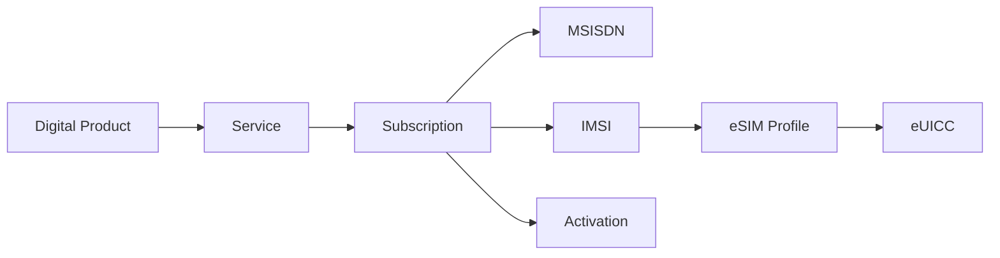

The goal is not to reproduce a vendor-specific provisioning implementation.

The goal is to define clear lifecycle boundaries between **commercial products, subscriber identity resources and network activation**.

---

# 2. Terminology

The architecture distinguishes several identifiers and resources that are sometimes incorrectly treated as interchangeable.

| Concept | Architectural Meaning |
|---|---|
| **SIM** | Subscriber identity module implemented as a removable physical card |
| **eSIM** | Embedded-SIM capability based on an eUICC with remotely managed profiles |
| **eUICC** | Secure element capable of hosting remotely provisioned SIM profiles |
| **EID** | Identifier associated with an eUICC |
| **Profile** | Operator subscription profile installed on an eUICC |
| **ICCID** | Identifier associated with a SIM/profile |
| **IMSI** | Subscriber identity used by the mobile network |
| **MSISDN** | Telephone number associated with a subscriber/service |
| **Subscription** | Logical subscriber-service relationship |
| **SM-DP+** | GSMA remote SIM provisioning function used for profile preparation/delivery in the consumer architecture |

These concepts should remain distinct in the domain model.

---

# 3. Resource Relationship Model

A simplified conceptual model is:

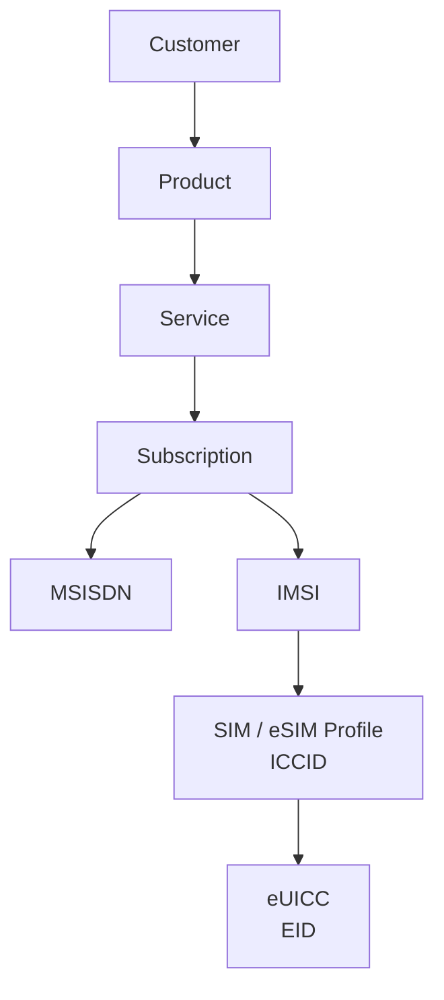

The model intentionally separates:

- Commercial product
- Operational service
- Subscription
- Telephone number
- Network subscriber identity
- SIM/profile
- eUICC

This enables each resource to evolve according to its own lifecycle.

---

# 4. Physical SIM vs eSIM

At the commercial level, both may provide the same subscriber service.

Their fulfillment paths differ.

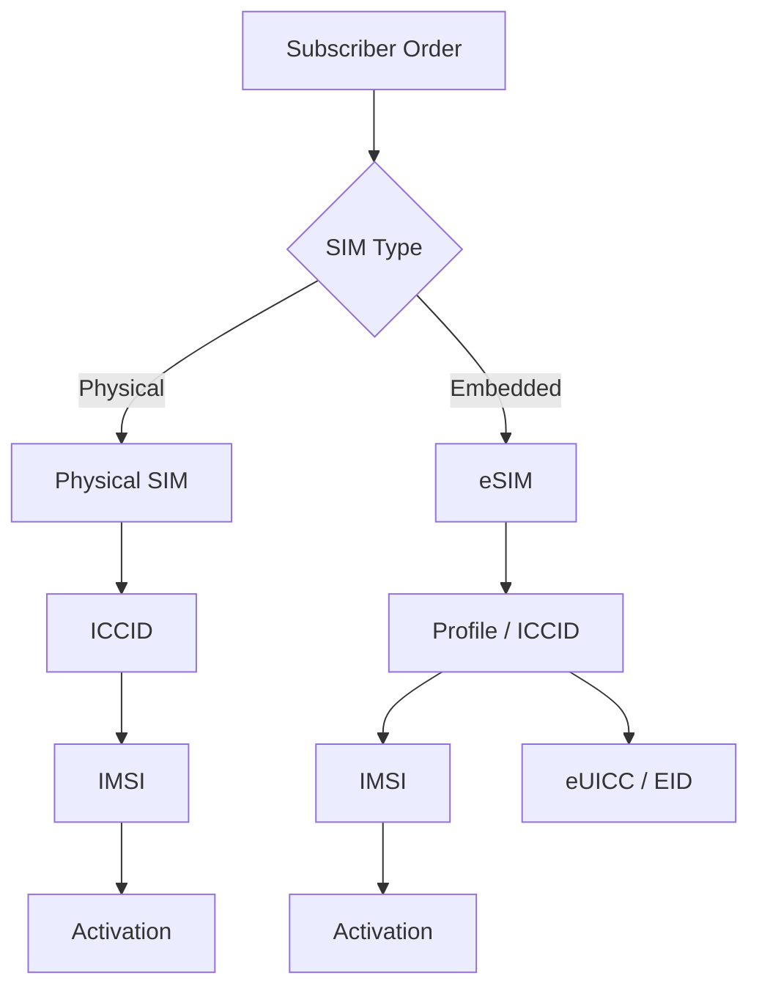

The product layer should not need separate commercial implementations for every underlying SIM technology unless the customer proposition itself requires that distinction.

---

# 5. Architecture Domains

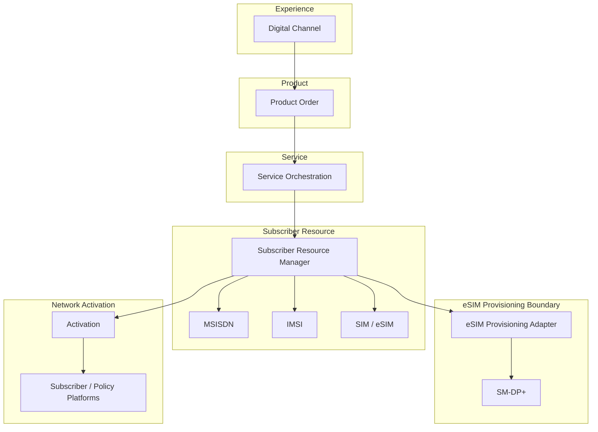

The **Subscriber Resource Manager** acts as an orchestration boundary.

It does not replace GSMA remote SIM provisioning components.

---

# 6. Subscriber Resource Manager

The Subscriber Resource Manager coordinates the lifecycle of subscriber-related resources.

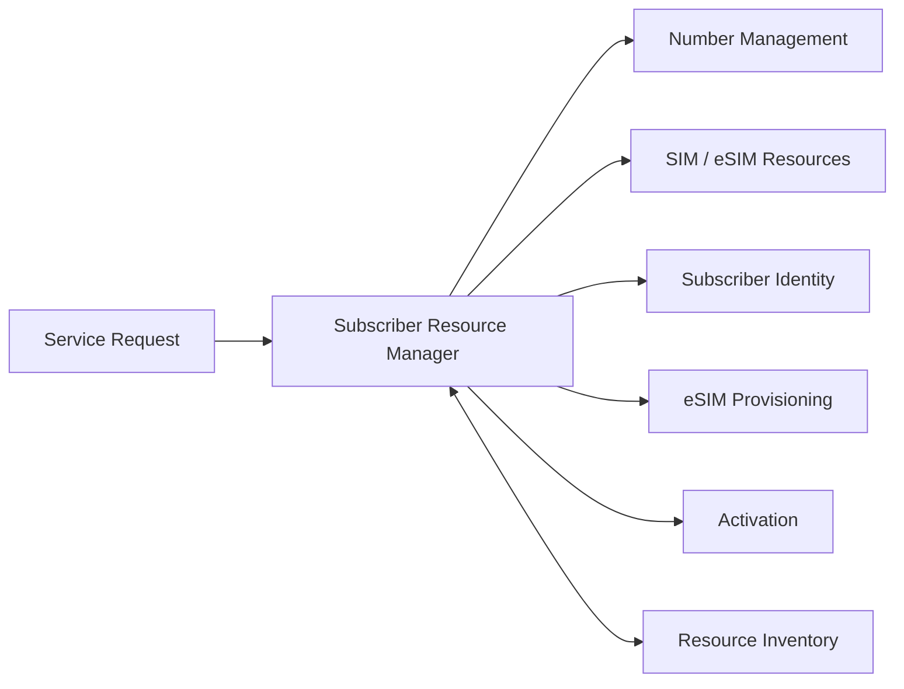

Responsibilities may include:

- MSISDN reservation
- SIM/eSIM resource allocation
- ICCID association
- IMSI association
- Subscription-resource relationships
- Resource state management
- Activation coordination
- Replacement workflows
- Release and reconciliation

> `Subscriber Resource Manager` is a project-specific architectural abstraction and is not presented as an official TM Forum component.

---

# 7. eSIM Activation Journey

A simplified digital eSIM onboarding journey:

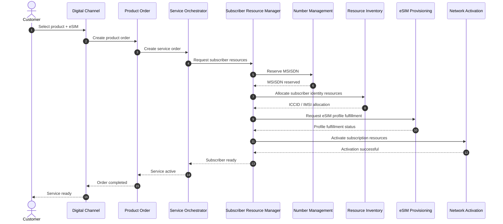

The exact RSP interaction is intentionally abstracted because implementation details depend on the selected GSMA architecture, platform and integration model.

---

# 8. eSIM Profile Provisioning Boundary

The remote SIM provisioning domain should remain isolated behind an adapter/interface.


The architecture deliberately avoids embedding SM-DP+ implementation logic inside Product Order or Service Order.

---

# 9. eSIM Profile Lifecycle

At a conceptual level, an eSIM profile passes through multiple operational states.

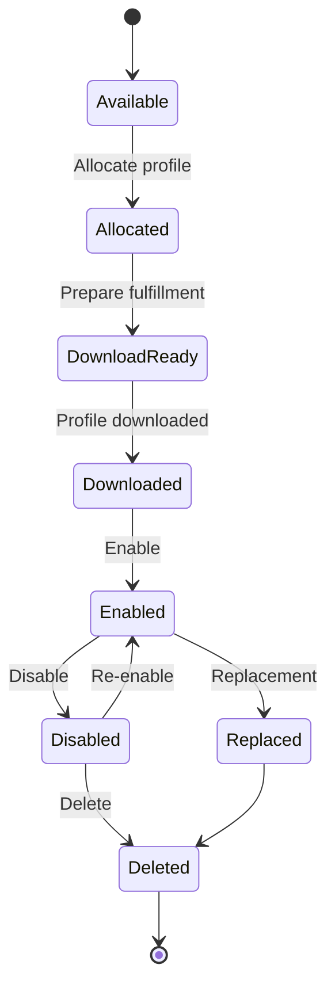

> This is a project-level lifecycle abstraction for architecture discussion.  
> Authoritative eSIM profile state definitions and procedures should be taken from the applicable GSMA specifications.

---

# 10. Physical SIM Lifecycle

Physical SIM lifecycle management differs because a physical inventory asset exists.

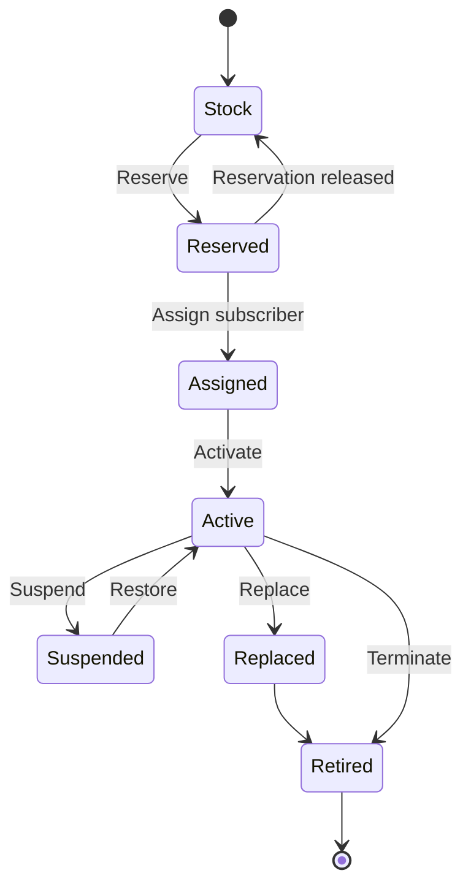

Typical physical SIM concerns include:

- Stock availability
- Distribution
- Reservation
- ICCID tracking
- Assignment
- Activation
- Replacement
- Retirement

---

# 11. MSISDN Lifecycle

MSISDN lifecycle management should remain independent from SIM lifecycle management.

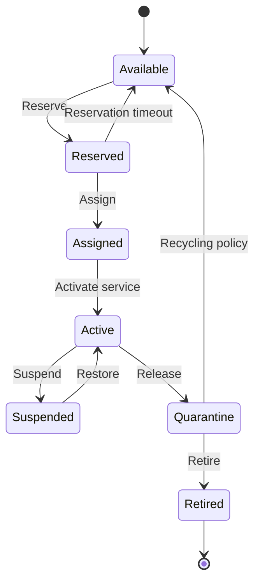

This separation enables scenarios such as:

- SIM replacement without number change
- eSIM migration while retaining the number
- service suspension without releasing the number
- controlled number recycling

---

# 12. IMSI Lifecycle

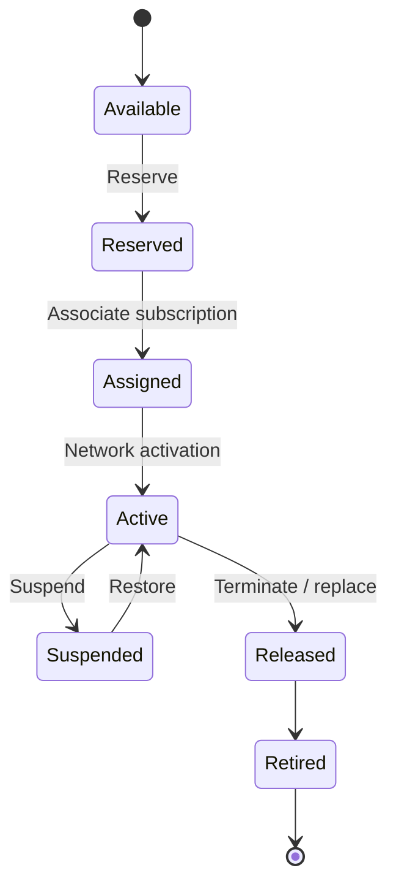

The precise lifecycle depends on network architecture and operator policies.

The important architectural principle is that **IMSI lifecycle is not assumed to be identical to MSISDN or SIM lifecycle**.

---

# 13. Independent Resource Lifecycles

A subscription can bind resources that evolve independently.

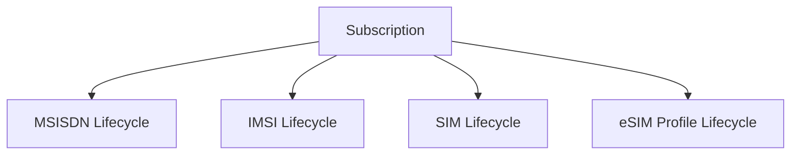

This is important because:

```text
SIM change      ≠ MSISDN change

eSIM replacement ≠ Product change

MSISDN suspension ≠ SIM deletion

Product change   ≠ Subscriber identity replacement
```

The orchestration layer must preserve these distinctions.

---

# 14. SIM Replacement

A SIM replacement should preserve the higher-level subscription where appropriate.

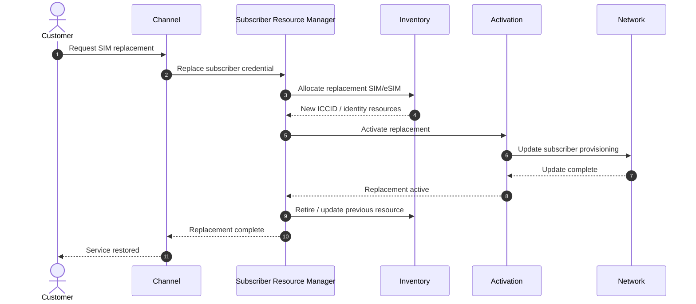

The customer should not need to repurchase the commercial product simply because the underlying subscriber credential changes.

---

# 15. eSIM Device Migration

Conceptually:


The exact migration mechanism depends on supported device, platform, operator and GSMA procedures.

The architecture therefore models migration as a business workflow while keeping implementation-specific RSP behavior behind the provisioning boundary.

---

# 16. Allocation vs Activation

Resource allocation must remain distinct from operational activation.


### Allocation answers

> Which resources belong to this subscription?

### Activation answers

> Are those resources operational?

This distinction becomes critical when provisioning fails after resources have already been assigned.

---

# 17. Activation Failure

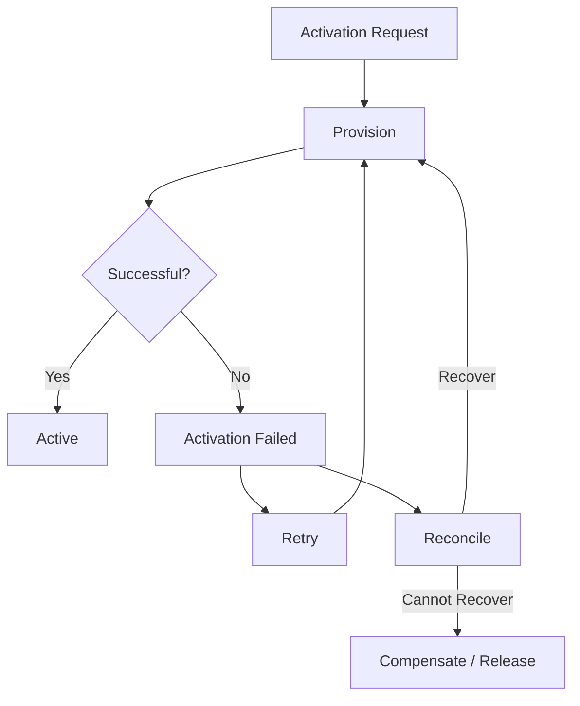

A failed activation must not automatically result in uncontrolled allocation of another MSISDN, ICCID or IMSI.

Idempotency and reconciliation are therefore mandatory architectural concerns.

---

# 18. Resource Reservation

Reservation protects scarce resources during long-running order workflows.

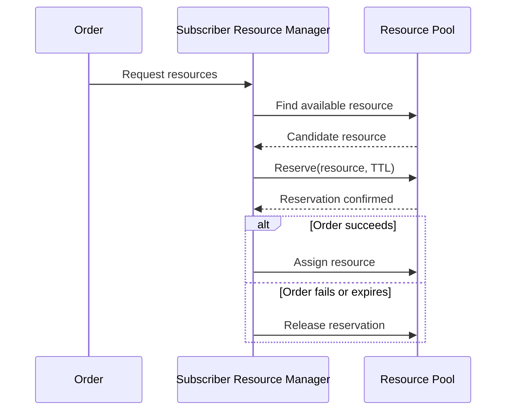

Reservations should have controlled expiration policies where appropriate.

---

# 19. Resource Exhaustion

The architecture should explicitly account for resource-pool exhaustion.

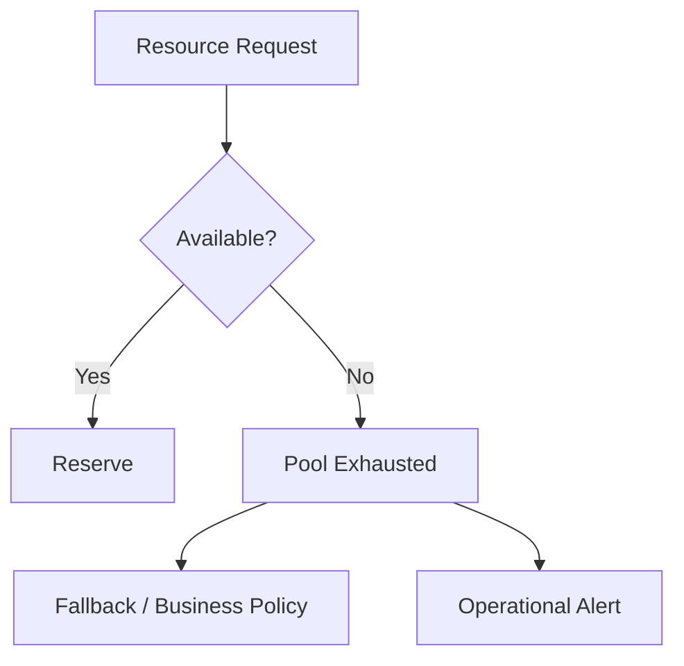

Examples include:

- MSISDN range exhaustion
- SIM inventory exhaustion
- eSIM profile pool exhaustion
- subscriber identity capacity constraints

Resource readiness therefore becomes part of **product launch readiness**.

---

# 20. Resource Readiness Dashboard

Conceptually, product enablement should have visibility into resource readiness before launch.

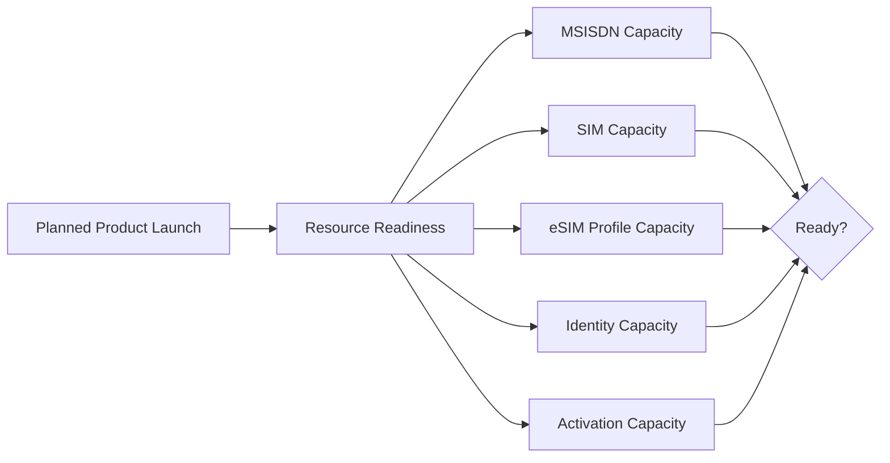

This connects subscriber-resource engineering with product planning.

---

# 21. Event Model

Subscriber-resource lifecycle changes can emit events.

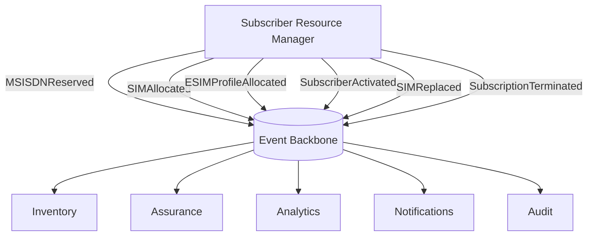

Example project-level events:

```text
MSISDNReservationRequested
MSISDNReserved
MSISDNReleased

SIMAllocated
SIMActivated
SIMReplaced
SIMRetired

ESIMProfileAllocated
ESIMProfileReady
ESIMProfileEnabled
ESIMProfileDisabled
ESIMProfileDeleted

SubscriberResourcesAllocated
SubscriberActivationRequested
SubscriberActivated
SubscriberActivationFailed

SubscriptionSuspended
SubscriptionRestored
SubscriptionTerminated
```

These are illustrative project event names unless explicitly mapped to standardized events.

---

# 22. TM Forum Alignment

The subscriber-resource architecture sits within a wider TM Forum-aligned product-to-resource flow.

```mermaid
flowchart LR

    TMF620["TMF620<br/>Product Catalog"]

    TMF622["TMF622<br/>Product Order"]

    TMF641["TMF641<br/>Service Order"]

    SRM["Subscriber Resource Manager"]

    TMF652["TMF652<br/>Resource Order"]

    TMF702["TMF702<br/>Resource Activation"]

    TMF639["TMF639<br/>Resource Inventory"]

    TMF638["TMF638<br/>Service Inventory"]

    TMF620 --> TMF622
    TMF622 --> TMF641

    TMF641 --> SRM

    SRM --> TMF652

    TMF652 --> TMF702

    TMF702 --> TMF639
    TMF702 --> TMF638
```

TM Forum APIs provide standardized capability boundaries where applicable.

They should not be interpreted as defining GSMA eSIM remote provisioning procedures.

---

# 23. TM Forum vs GSMA Boundary

This distinction is important.

```mermaid
flowchart LR

    PRODUCT["Product / Service<br/>Lifecycle"]

    TMF["TM Forum-aligned<br/>Business & Operational APIs"]

    SRM["Subscriber Resource<br/>Orchestration"]

    GSMA["GSMA eSIM<br/>Provisioning Domain"]

    NETWORK["Mobile Network<br/>Activation"]

    PRODUCT --> TMF
    TMF --> SRM
    SRM --> GSMA
    SRM --> NETWORK
```

Conceptually:

**TM Forum**

helps structure product, service and resource management capabilities.

**GSMA**

defines the relevant eSIM ecosystem architecture and remote SIM provisioning specifications.

The two standards domains are complementary rather than interchangeable.

---

# 24. Security Boundary

Subscriber identifiers and eSIM provisioning are security-sensitive domains.

```mermaid
flowchart TB

    CHANNEL["Channel"]

    IAM["Identity & Access"]

    API["API Gateway"]

    SRM["Subscriber Resource Manager"]

    POLICY["Authorization Policy"]

    AUDIT["Audit"]

    RSP["eSIM Provisioning"]

    NETWORK["Network Provisioning"]

    CHANNEL --> API
    IAM --> API

    API --> SRM

    POLICY --> SRM

    SRM --> RSP
    SRM --> NETWORK

    API --> AUDIT
    SRM --> AUDIT
```

Architecture controls should consider:

- Strong authentication
- Authorization
- Least privilege
- Service identity
- Encryption in transit
- Sensitive identifier protection
- Secrets management
- Auditability
- Replay protection
- Idempotency
- Controlled provisioning interfaces

---

# 25. Observability

The full eSIM activation journey should be traceable.

```mermaid
flowchart LR

    ORDER["Product Order"]

    SERVICE["Service Order"]

    RESERVE["Resource Reservation"]

    PROFILE["Profile Fulfillment"]

    ACT["Activation"]

    NETWORK["Network"]

    READY["Subscriber Ready"]

    ORDER --> SERVICE
    SERVICE --> RESERVE
    RESERVE --> PROFILE
    PROFILE --> ACT
    ACT --> NETWORK
    NETWORK --> READY
```

A common correlation identifier should allow operators to trace:

```text
Product Order
      ↓
Service Order
      ↓
MSISDN Reservation
      ↓
ICCID / IMSI Allocation
      ↓
eSIM Profile Fulfillment
      ↓
Network Activation
      ↓
Inventory Update
      ↓
Subscriber Ready
```

---

# 26. Operational Metrics

Useful operational measures may include:

### Resource

- Available MSISDN pool
- Reservation utilization
- SIM inventory
- eSIM profile availability
- Resource allocation failure rate

### Activation

- Activation success rate
- Activation latency
- Retry rate
- Reconciliation backlog
- Partial activation count

### Customer Journey

- eSIM onboarding completion
- Time to activate
- Profile fulfillment failures
- Replacement completion
- Digital journey drop-off

The exact KPI definitions depend on implementation and operating model.

---

# 27. Design Principles

1. **SIM, IMSI and MSISDN are different lifecycle entities**
2. **Subscription is not synonymous with SIM**
3. **Allocation and activation remain separate**
4. **Commercial products remain insulated from provisioning internals**
5. **eSIM RSP remains behind a dedicated integration boundary**
6. **Resource reservation must support expiration and compensation**
7. **Activation must be idempotent**
8. **Failed workflows must be reconcilable**
9. **Resource readiness is part of product readiness**
10. **Every subscriber activation should be observable end-to-end**

---

# 28. Architectural North Star

```mermaid
flowchart LR

    SELECT["Select Product"]

    ORDER["Order"]

    RESERVE["Reserve Identity"]

    PROFILE["Fulfill SIM/eSIM"]

    ACT["Activate"]

    VERIFY["Verify"]

    READY["Subscriber Ready"]

    OBSERVE["Observe"]

    SELECT --> ORDER
    ORDER --> RESERVE
    RESERVE --> PROFILE
    PROFILE --> ACT
    ACT --> VERIFY
    VERIFY --> READY
    READY --> OBSERVE
```

> **The goal is not merely to provision an eSIM.**
>
> **The goal is to make subscriber-resource readiness, allocation, activation, replacement and lifecycle management reusable capabilities of the digital product platform.**

---

## Standards Boundary

This repository is an independent reference architecture.

TM Forum Open APIs and ODA/SID concepts are referenced for interoperability and architecture purposes.

GSMA terminology is referenced to describe the eSIM ecosystem at an architectural level.

Official TM Forum and GSMA specifications remain the authoritative sources for their respective standards.

The lifecycle states and orchestration models in this document are project-level abstractions unless explicitly identified as standardized behavior.

---

## Related Documentation

- [Project Overview](../README.md)
- [Reference Architecture](architecture.md)
- [Product Lifecycle](product-lifecycle.md)
- [ADR-001 — Domain Separation](design-decisions/ADR-001-domain-separation.md)
- `msisdn-lifecycle.md`
- `tmf-api-mapping.md`
- `sid-domain-model.md`

---

## Author

**Mohamed Salman**

Solution & Enterprise Architecture · Digital Platforms · Telecommunications · Data & AI

---

**Digital Telco Product Activation Architecture**

*From product idea to activated subscriber.*
