# MSISDN Resource Lifecycle & Number Management

> **From Number Inventory to Active Subscriber Assignment**  
> Architecture & Research by **Mohamed Salman**

---

## 1. Purpose

An MSISDN is more than a field attached to a subscriber record.

In a digital telecommunications platform, telephone numbers represent a managed resource pool with their own:

- Availability
- Reservation
- Assignment
- Activation
- Suspension
- Release
- Quarantine
- Recycling
- Portability
- Audit lifecycle

This document defines a vendor-neutral architecture for managing the **MSISDN lifecycle independently from Product, Service, SIM/eSIM and IMSI lifecycles**.

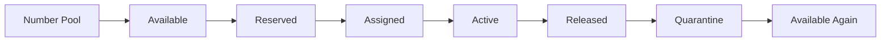

The architectural objective is:

> **Treat numbering as a reusable platform capability rather than embedding number logic inside individual products or channels.**

---

# 2. Core Principle

The following entities must remain logically distinct:

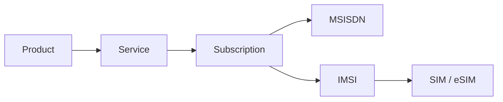

Therefore:

```text
MSISDN ≠ SIM
MSISDN ≠ IMSI
MSISDN ≠ Subscription
MSISDN ≠ Product
```

This distinction allows each resource to evolve independently.

---

# 3. Why Number Management Is a Platform Capability

A product should request a **numbering capability**, not manipulate number inventory directly.

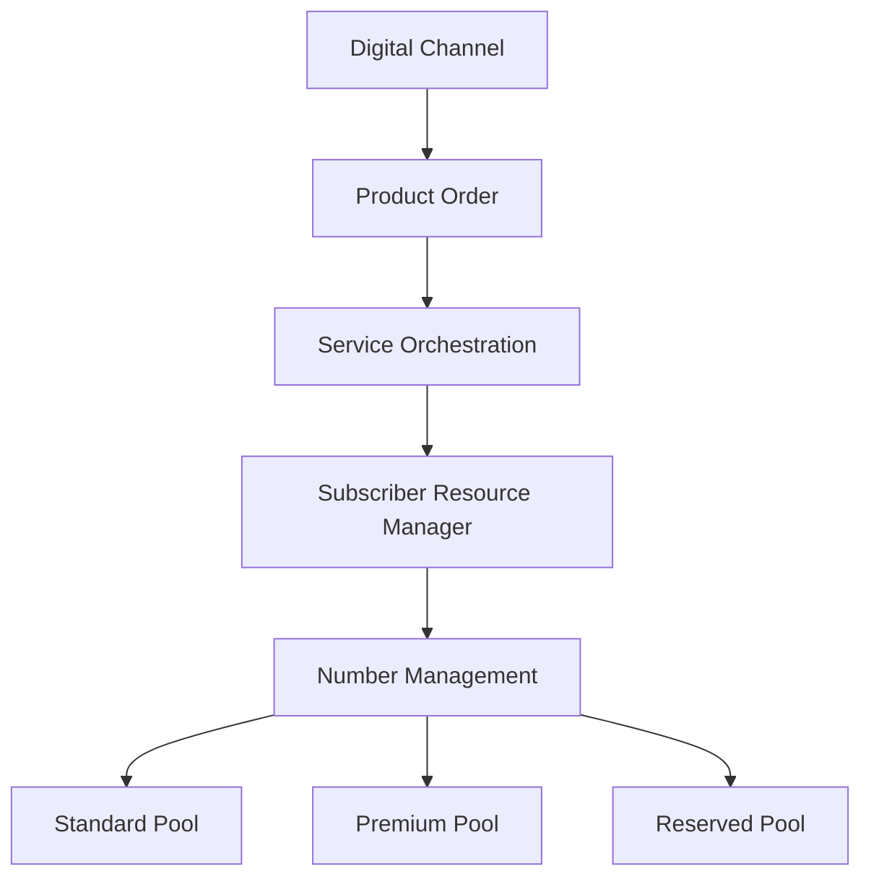

This isolates:

- Number selection
- Number eligibility
- Pool management
- Reservation
- Assignment
- Release
- Quarantine
- Recycling policy

from commercial product logic.

---

# 4. MSISDN Lifecycle

A conceptual lifecycle:

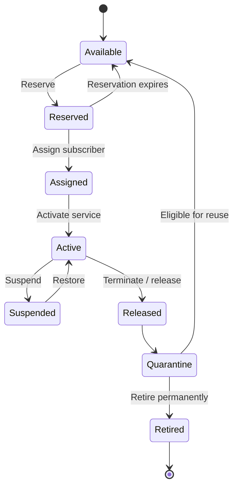

> The states above are a project-level lifecycle abstraction. Exact states and reuse policies depend on operator policy and applicable numbering regulation.

---

# 5. Number Inventory Model

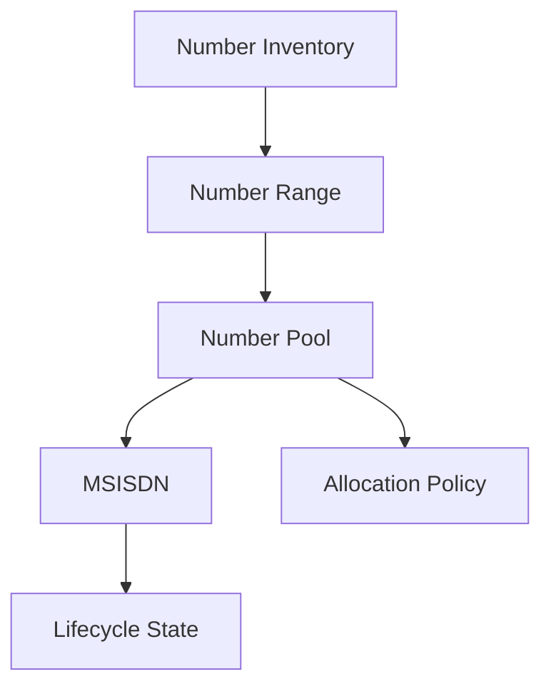

A number-management implementation may maintain attributes such as:

```text
MSISDN
Number Range
Pool
Status
Reservation ID
Reservation Expiry
Subscription Relationship
Assignment Timestamp
Release Timestamp
Reuse Eligibility
Portability State
```

The exact information model remains implementation-specific.

---

# 6. Number Pool Segmentation

Not every number needs to be allocated using the same policy.

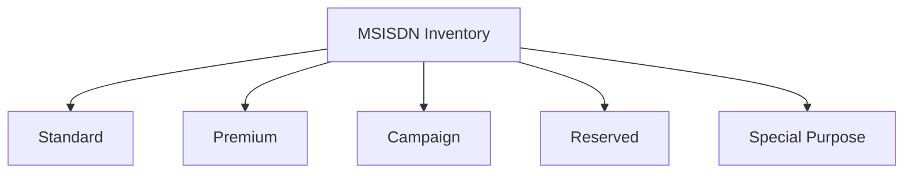

Pool segmentation can support commercial and operational policies without exposing inventory internals to digital channels.

---

# 7. Number Reservation

Digital ordering often requires temporary reservation before final assignment.

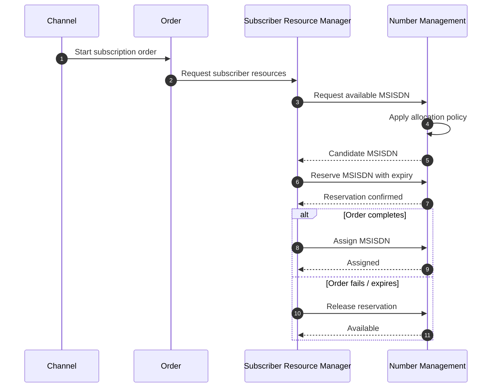

Temporary reservation prevents two concurrent customer journeys from receiving the same number.

---

# 8. Reservation Concurrency

Number allocation must handle concurrent requests safely.

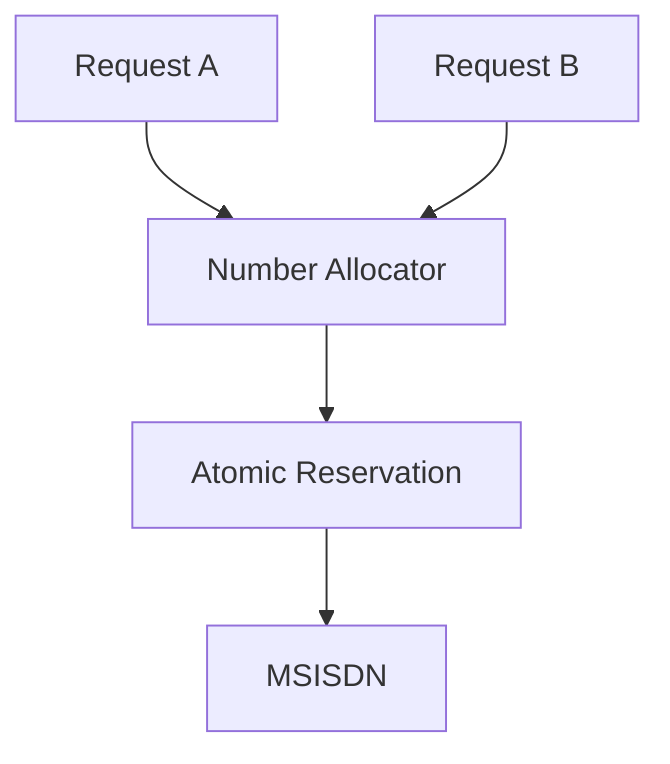

The implementation must guarantee that a single allocatable MSISDN cannot be successfully reserved by multiple competing transactions.

Possible implementation mechanisms vary by technology, but the architectural requirement is **atomic allocation**.

---

# 9. Reservation Expiry

Reservations should not remain indefinitely when an order is abandoned.

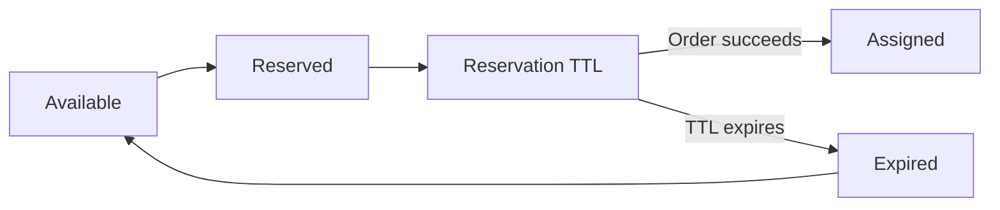

This prevents abandoned customer journeys from slowly exhausting the available number pool.

---

# 10. MSISDN Assignment

Reservation and assignment are different operations.


### Reservation

> Temporarily hold the number.

### Assignment

> Establish the number-to-subscription relationship.

### Activation

> Make the associated service operational.

This separation improves rollback and failure recovery.

---

# 11. Product Activation Journey

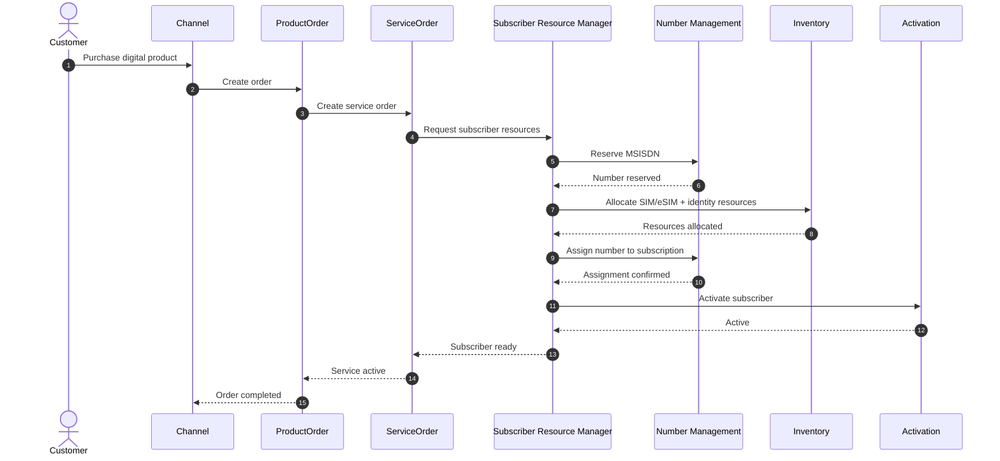

---

# 12. Number Selection

A digital product may support either automatic allocation or customer selection.

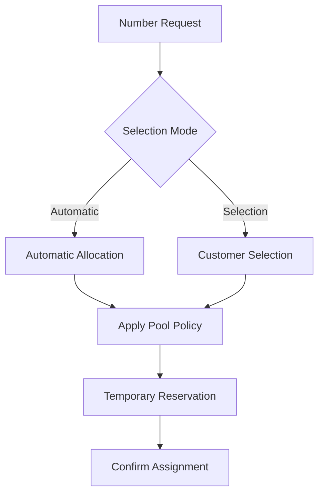

The channel should receive only numbers eligible for the requested journey.

It should not have unrestricted access to the underlying number inventory.

---

# 13. Number Search Boundary

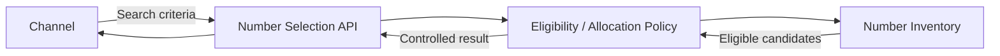

This protects inventory implementation and allows allocation policy to evolve independently from the customer experience.

---

# 14. SIM Replacement

One of the most important lifecycle distinctions is:

> **Changing a SIM does not inherently require changing the MSISDN.**

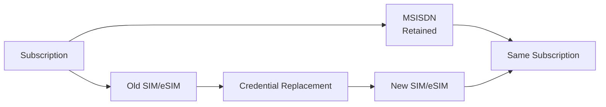

The number-to-subscription relationship can remain stable while the underlying subscriber credential changes.

---

# 15. Product Change

Likewise, changing the commercial product does not necessarily require changing the number.

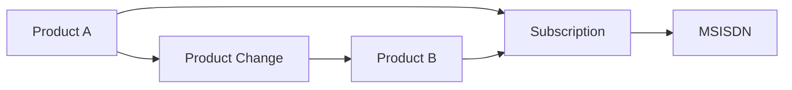

This is another reason to avoid embedding MSISDN lifecycle logic directly inside product definitions.

---

# 16. Suspension

Suspension does not automatically mean resource release.


This preserves subscriber identity during temporary service suspension.

The exact retention policy is operator-specific.

---

# 17. Termination & Release

Termination is different.

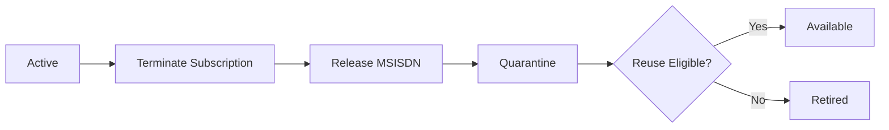

A released number should not automatically become immediately available for another subscriber.

---

# 18. Number Quarantine

Quarantine provides a controlled period between release and potential reuse.

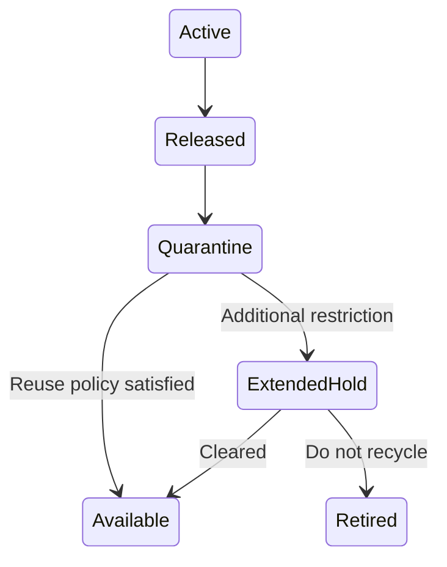

Reasons for quarantine may include:

- Operational policy
- Regulatory requirements
- Customer protection
- Portability status
- Fraud controls
- Reconciliation

The duration and exact rules must come from applicable operator and regulatory policy rather than being hard-coded into the architecture.

---

# 19. Number Portability Boundary

Mobile number portability introduces a different lifecycle because the subscriber may retain the number while changing provider.


The detailed portability process is jurisdiction- and operator-specific.

Therefore this repository treats number portability as an external capability boundary rather than defining regulatory procedures.

---

# 20. Port-In vs New Number

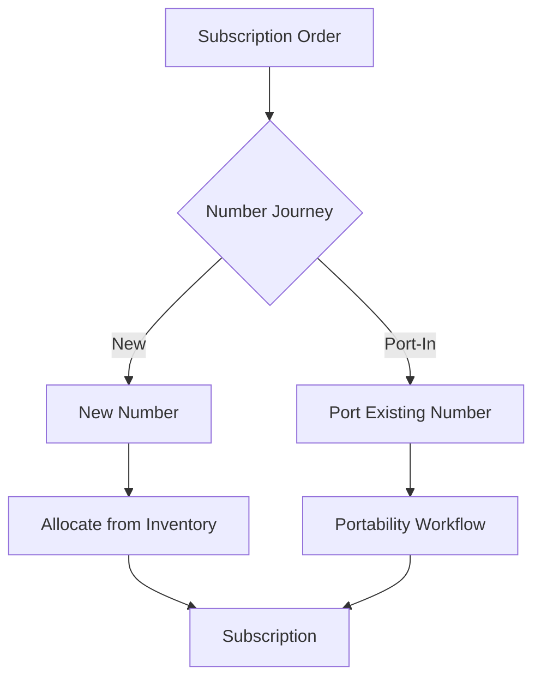

The product journey may remain common while the number-fulfillment path differs.

---

# 21. Resource Exhaustion

MSISDN inventory is finite.

The architecture must therefore detect and surface pool exhaustion.

```mermaid
flowchart TB

    REQUEST["Number Request"]

    POOL["Eligible Pool"]

    CHECK{"Capacity?"}

    ALLOCATE["Allocate"]

    LOW["Low Inventory"]

    EXHAUSTED["Pool Exhausted"]

    ALERT["Operational Alert"]

    REQUEST --> POOL
    POOL --> CHECK

    CHECK -->|"Available"| ALLOCATE

    CHECK -->|"Low"| LOW
    LOW --> ALLOCATE
    LOW --> ALERT

    CHECK -->|"None"| EXHAUSTED
    EXHAUSTED --> ALERT
```

Number capacity should therefore be observable before it becomes a customer-facing failure.

---

# 22. Product Launch Readiness

Number inventory can be a dependency of product launch.

```mermaid
flowchart LR

    LAUNCH["Planned Product Launch"]

    FORECAST["Demand Forecast"]

    CAPACITY["Number Capacity"]

    POLICY["Allocation Policy"]

    READY{"Ready?"}

    GO["Launch"]

    HOLD["Resolve Capacity"]

    LAUNCH --> FORECAST

    FORECAST --> CAPACITY
    CAPACITY --> POLICY
    POLICY --> READY

    READY -->|"Yes"| GO
    READY -->|"No"| HOLD
```

This connects number management directly with product planning and launch readiness.

---

# 23. Number Inventory Observability

```mermaid
flowchart TB

    INVENTORY["MSISDN Inventory"]

    AVAILABLE["Available"]

    RESERVED["Reserved"]

    ASSIGNED["Assigned"]

    ACTIVE["Active"]

    QUARANTINE["Quarantine"]

    PORTING["Porting"]

    DASH["Operational View"]

    INVENTORY --> AVAILABLE
    INVENTORY --> RESERVED
    INVENTORY --> ASSIGNED
    INVENTORY --> ACTIVE
    INVENTORY --> QUARANTINE
    INVENTORY --> PORTING

    AVAILABLE --> DASH
    RESERVED --> DASH
    ASSIGNED --> DASH
    ACTIVE --> DASH
    QUARANTINE --> DASH
    PORTING --> DASH
```

Useful operational measures may include:

- Available numbers
- Pool utilization
- Reservation count
- Reservation expiration rate
- Allocation latency
- Allocation failures
- Quarantine inventory
- Porting state
- Number release rate
- Capacity threshold alerts

---

# 24. Event Model

Number lifecycle transitions can publish domain events.

```mermaid
flowchart TB

    NM["Number Management"]

    BUS[("Event Backbone")]

    ORDER["Order"]
    INVENTORY["Inventory"]
    ASSURANCE["Assurance"]
    ANALYTICS["Analytics"]
    AUDIT["Audit"]

    NM -->|"MSISDNReserved"| BUS
    NM -->|"MSISDNAssigned"| BUS
    NM -->|"MSISDNActivated"| BUS
    NM -->|"MSISDNSuspended"| BUS
    NM -->|"MSISDNReleased"| BUS

    BUS --> ORDER
    BUS --> INVENTORY
    BUS --> ASSURANCE
    BUS --> ANALYTICS
    BUS --> AUDIT
```

Illustrative project-level events:

```text
MSISDNReservationRequested
MSISDNReserved
MSISDNReservationExpired

MSISDNAssigned
MSISDNActivated

MSISDNSuspended
MSISDNRestored

MSISDNReleaseRequested
MSISDNReleased

MSISDNQuarantined
MSISDNReuseEligible

NumberPoolLow
NumberPoolExhausted
```

These names are project-specific examples unless explicitly mapped to standardized events.

---

# 25. Idempotency

Number allocation APIs must tolerate retries safely.

Consider:

```text
POST /numberReservations
```

If the caller times out after the number was successfully reserved, retrying the request must not create another reservation unintentionally.

```mermaid
flowchart LR

    REQUEST["Reservation Request"]

    KEY["Idempotency Key"]

    CHECK{"Already Processed?"}

    OLD["Return Existing Reservation"]

    NEW["Create Reservation"]

    REQUEST --> KEY
    KEY --> CHECK

    CHECK -->|"Yes"| OLD
    CHECK -->|"No"| NEW
```

This becomes especially important in distributed product-order workflows.

---

# 26. Failure & Compensation

```mermaid
flowchart TB

    RESERVE["Reserve MSISDN"]

    ASSIGN["Assign"]

    ACT["Activate Subscriber"]

    CHECK{"Activation Successful?"}

    ACTIVE["Active"]

    RETRY["Retry Activation"]

    RELEASE["Release Assignment"]

    QUARANTINE["Quarantine if Required"]

    RESERVE --> ASSIGN
    ASSIGN --> ACT

    ACT --> CHECK

    CHECK -->|"Yes"| ACTIVE

    CHECK -->|"Recoverable"| RETRY
    RETRY --> ACT

    CHECK -->|"Compensate"| RELEASE
    RELEASE --> QUARANTINE
```

The compensation policy should depend on the failure state rather than automatically releasing every allocated resource.

---

# 27. TM Forum Alignment

The MSISDN capability participates in the wider Product → Service → Resource architecture.

```mermaid
flowchart LR

    TMF620["TMF620<br/>Product Catalog"]

    TMF622["TMF622<br/>Product Order"]

    TMF641["TMF641<br/>Service Order"]

    SRM["Subscriber Resource Manager"]

    NUMBER["Number Management"]

    TMF652["TMF652<br/>Resource Order"]

    TMF639["TMF639<br/>Resource Inventory"]

    TMF702["TMF702<br/>Resource Activation"]

    TMF620 --> TMF622

    TMF622 --> TMF641

    TMF641 --> SRM

    SRM --> NUMBER

    SRM --> TMF652

    TMF652 --> TMF702

    NUMBER <--> TMF639
```

The diagram shows **reference-architecture alignment**, not a claim that a specific TM Forum API defines the complete MSISDN-management lifecycle described here.

---

# 28. API Boundary

A project-specific Number Management capability could expose an interface conceptually like:

```text
GET  /numbers/availability

POST /numberReservations

GET  /numberReservations/{id}

POST /numberAssignments

POST /numberReleases

GET  /numberPools/{id}/capacity
```

These endpoints are illustrative architecture examples.

They are **not presented as TM Forum API definitions**.

The preferred implementation should reuse applicable standardized APIs where they meet the required capability.

---

# 29. Security & Governance

Number management requires controlled access.

```mermaid
flowchart LR

    CHANNEL["Channel"]

    API["API Gateway"]

    POLICY["Authorization"]

    NUMBER["Number Management"]

    AUDIT["Audit"]

    INVENTORY["Number Inventory"]

    CHANNEL --> API

    API --> POLICY

    POLICY --> NUMBER

    NUMBER --> INVENTORY

    API --> AUDIT
    NUMBER --> AUDIT
```

Controls should consider:

- Authentication
- Authorization
- Least privilege
- Audit logging
- Rate limiting
- Abuse prevention
- Sensitive identifier handling
- Reservation controls
- Administrative access separation

---

# 30. Architectural Invariants

The following rules should remain true across implementations:

**1. One active assignment cannot belong to multiple unrelated subscriptions simultaneously.**

**2. Reservation must be atomic.**

**3. Expired reservations must not permanently consume inventory.**

**4. SIM replacement does not inherently imply MSISDN replacement.**

**5. Suspension does not inherently imply MSISDN release.**

**6. Released numbers do not automatically become immediately reusable.**

**7. Product channels do not manipulate number inventory directly.**

**8. Number allocation is independently observable.**

**9. Retried requests must not unintentionally allocate additional numbers.**

**10. Lifecycle transitions must be auditable.**

---

# 31. Architectural North Star

```mermaid
flowchart LR

    FORECAST["Forecast"]

    POOL["Manage Pool"]

    DISCOVER["Discover"]

    RESERVE["Reserve"]

    ASSIGN["Assign"]

    ACTIVATE["Activate"]

    OBSERVE["Observe"]

    RELEASE["Release"]

    QUARANTINE["Quarantine"]

    REUSE["Reuse"]

    FORECAST --> POOL
    POOL --> DISCOVER
    DISCOVER --> RESERVE
    RESERVE --> ASSIGN
    ASSIGN --> ACTIVATE
    ACTIVATE --> OBSERVE
    OBSERVE --> RELEASE
    RELEASE --> QUARANTINE
    QUARANTINE --> REUSE
    REUSE --> POOL
```

The goal is:

> **Turn MSISDN management from product-specific provisioning logic into a governed, observable and reusable digital platform capability.**

---

## Standards Boundary

This document is an independent reference architecture.

TM Forum Open APIs and ODA/SID concepts are referenced for interoperability and architectural alignment.

Number allocation, portability, quarantine and recycling policies can also be subject to operator and jurisdiction-specific requirements.

Official TM Forum specifications and applicable telecommunications regulations remain authoritative.

---

## Related Documentation

- [Project Overview](../README.md)
- [Reference Architecture](architecture.md)
- [Product Lifecycle](product-lifecycle.md)
- [SIM & eSIM Lifecycle](esim-lifecycle.md)
- [ADR-001 — Domain Separation](design-decisions/ADR-001-domain-separation.md)
- `tmf-api-mapping.md`
- `sid-domain-model.md`

---

## Author

**Mohamed Salman**

Solution & Enterprise Architecture · Digital Platforms · Telecommunications · Data & AI

---

**Digital Telco Product Activation Architecture**

*From product idea to activated subscriber.*
