# Digital Telco Product Lifecycle

> **From Market Opportunity to Activated & Measurable Product**  
> Architecture & Research by **Mohamed Salman**

---

## 1. Purpose

A digital telecom product lifecycle does not end when a product is designed or published to a catalog.

The complete lifecycle connects:

**Market Opportunity → Product Strategy → Design → Configure → Launch → Order → Activate → Adopt → Measure → Improve**

This document defines a vendor-neutral lifecycle connecting **commercial product management** with the technology capabilities required to launch, operate, measure, and evolve digital telecom products.

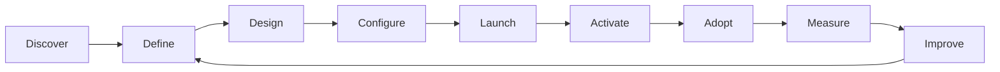

The objective is simple:

> **Reduce the distance between identifying a market opportunity and delivering a measurable product to an active subscriber.**

---

# 2. Product Lifecycle Model

The reference lifecycle contains nine stages.

| Stage | Primary Question | Outcome |
|---|---|---|
| **Discover** | Where is the opportunity? | Opportunity hypothesis |
| **Define** | What should we offer? | Product proposition |
| **Design** | How should it work? | Product design |
| **Configure** | Can the platform represent it? | Launchable configuration |
| **Launch** | Can customers access it? | Market availability |
| **Activate** | Can it become a working service? | Active subscriber |
| **Adopt** | Are customers using it? | Product adoption |
| **Measure** | Is it delivering value? | Performance insight |
| **Improve** | What should change next? | New product iteration |

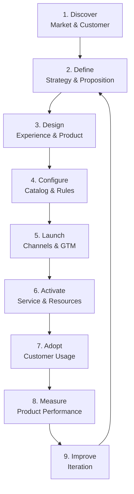

---

# 3. Stage 1 — Discover

Product development begins with an opportunity, not a technical feature.

Inputs may include:

- Customer needs
- Customer behavior
- Market trends
- Competitive propositions
- Usage patterns
- Customer feedback
- Commercial performance
- Technology capabilities
- Regulatory constraints
- Partner opportunities

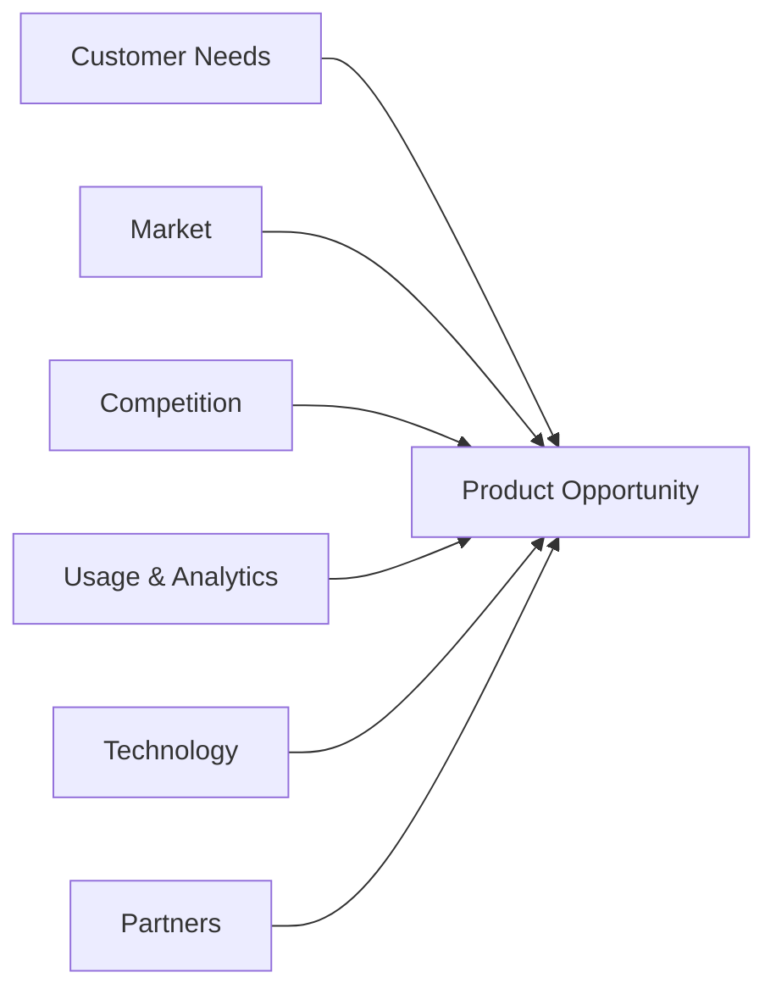

### Output

A product opportunity should clearly identify:

```text
Customer Problem
       +
Target Segment
       +
Potential Value
       +
Strategic Fit
       =
Product Opportunity
```

---

# 4. Stage 2 — Define

The opportunity becomes a product proposition.

A useful product definition answers:

- Who is the target customer?
- What problem are we solving?
- What is the customer value?
- What capabilities are required?
- What differentiates the proposition?
- How will success be measured?
- What dependencies exist?

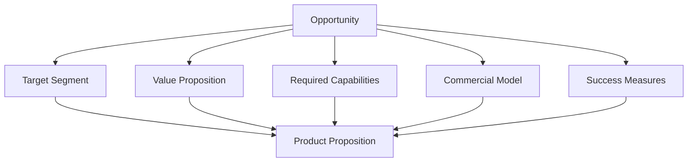

---

# 5. Product Strategy Canvas

A product can be represented through six connected dimensions.

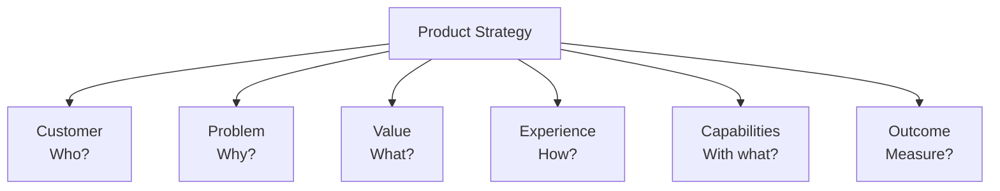

A strong product proposition should connect all six.

A technically feasible product without customer value is weak.

A commercially attractive product without platform readiness cannot be reliably launched.

---

# 6. Stage 3 — Design

Product design connects commercial intent with customer experience and technical capability.

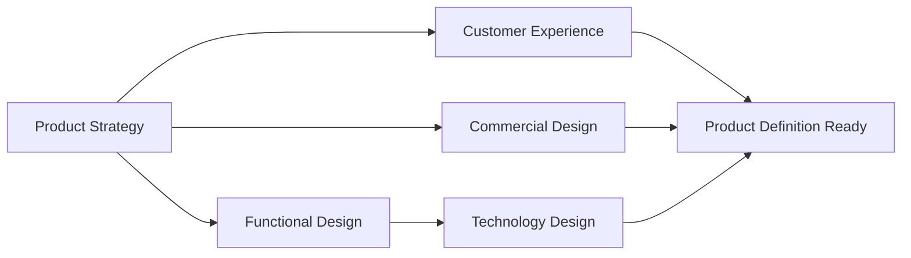

Product design may define:

- Offering structure
- Bundles
- Add-ons
- Eligibility
- Pricing
- Allowances
- Customer journey
- Activation requirements
- Lifecycle behavior
- Channel availability

---

# 7. Stage 4 — Configure

The product definition now becomes a machine-readable platform configuration.

This is the bridge between **product management and technology enablement**.

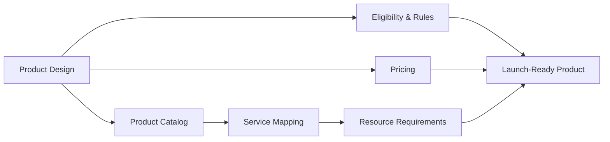

Where applicable, the Product Catalog capability can align with **TMF620 Product Catalog Management**.

---

# 8. Product Capability Readiness

Before launch, product readiness should be assessed across multiple dimensions.

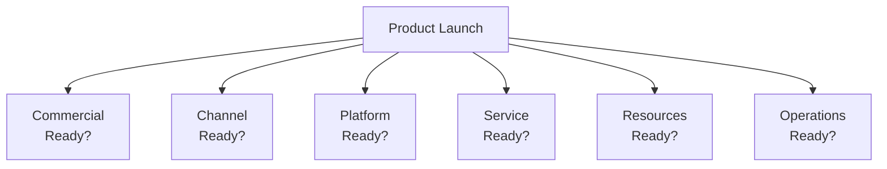

### Example readiness questions

**Commercial**

- Is the proposition approved?
- Is pricing defined?
- Are eligibility rules confirmed?

**Channel**

- Can customers discover the product?
- Can they purchase it?
- Can they manage it after activation?

**Platform**

- Is the catalog configured?
- Are APIs available?
- Are ordering workflows ready?

**Service**

- Can required services be instantiated?

**Resource**

- Are required subscriber resources available?
- Is SIM/eSIM capacity ready?
- Is MSISDN inventory sufficient?

**Operations**

- Is monitoring available?
- Can failures be reconciled?
- Is support prepared?

---

# 9. Stage 5 — Launch

A product launch is a coordinated business and technology event.

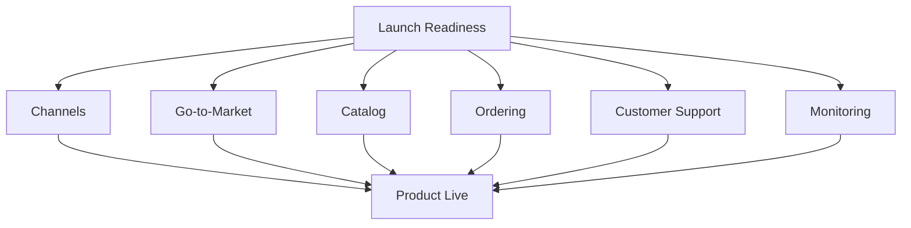

The objective is not simply:

> Product published.

The real objective is:

> **Product discoverable, purchasable, activatable, supportable and measurable.**

---

# 10. Stage 6 — Activate

Once purchased, the commercial product must become an operational service.

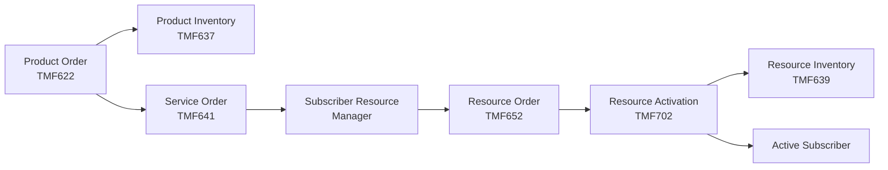

This is the point where product management and operational architecture meet.

---

# 11. Subscriber Resource Readiness

Digital mobile products may depend on subscriber resources being available before or during activation.

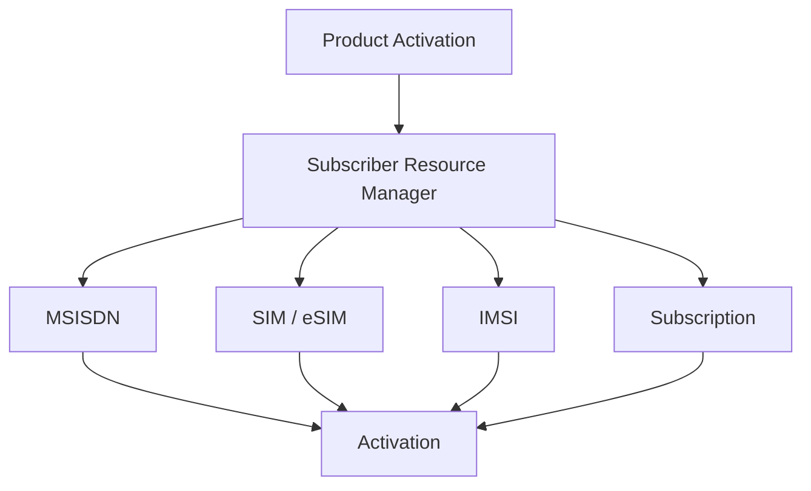

Resource readiness may include:

- Available number inventory
- Number reservation capacity
- SIM inventory
- eSIM profile availability
- IMSI availability
- Allocation policies
- Activation capacity
- Provisioning connectivity

---

# 12. Product Launch Sequence

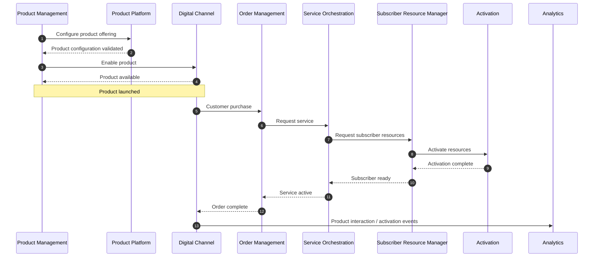

---

# 13. Stage 7 — Adopt

Launch does not equal adoption.

Product adoption can be viewed as a funnel.

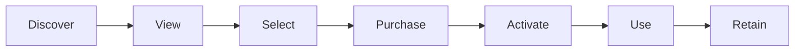

Each transition can reveal a different problem.

For example:

```text
High views + Low purchase
        ↓
Possible proposition / pricing / eligibility issue

High purchase + Low activation
        ↓
Possible technology / resource / provisioning issue

High activation + Low usage
        ↓
Possible product value / experience issue
```

This distinction is critical because not every product-performance problem is a technology problem.

---

# 14. Stage 8 — Measure

A digital product should be measurable across commercial, experience and technology dimensions.

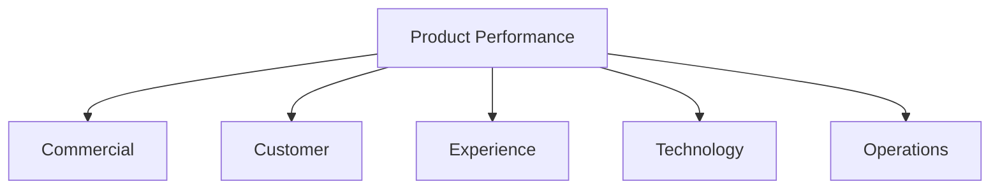

### Commercial

Examples:

- Orders
- Conversion
- Revenue
- Attach rate
- Upgrade rate

### Customer

Examples:

- Adoption
- Retention
- Churn
- Product usage

### Experience

Examples:

- Journey completion
- Drop-off
- Activation time
- Failed journeys

### Technology

Examples:

- API latency
- Error rate
- Activation success
- Provisioning latency

### Operations

Examples:

- Failed orders
- Reconciliation backlog
- Resource exhaustion
- Manual intervention rate

---

# 15. Product-to-Technology KPI Tree

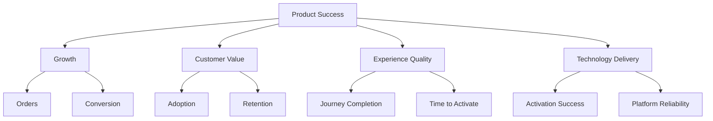

The purpose is not to prescribe universal KPIs.

It is to connect product outcomes with the underlying capabilities that influence them.

---

# 16. Stage 9 — Improve

Product management becomes a continuous feedback system.

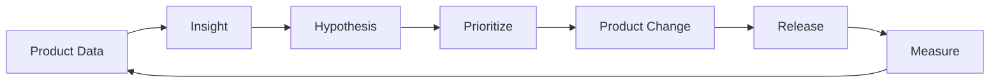

This turns the product roadmap into an evidence-driven lifecycle rather than a static feature list.

---

# 17. Product Roadmap Model

The roadmap should connect business outcomes with platform capabilities.

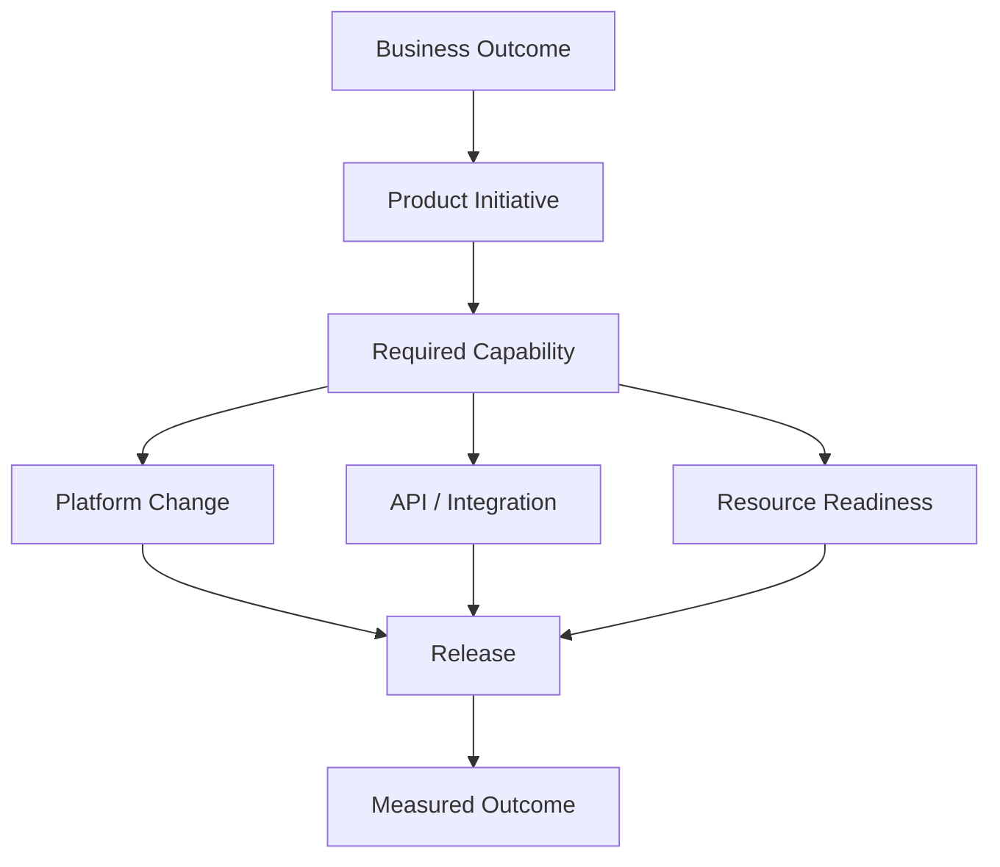

This prevents a roadmap from becoming merely a collection of features.

---

# 18. Capability-Based Planning

A single capability can support multiple products.

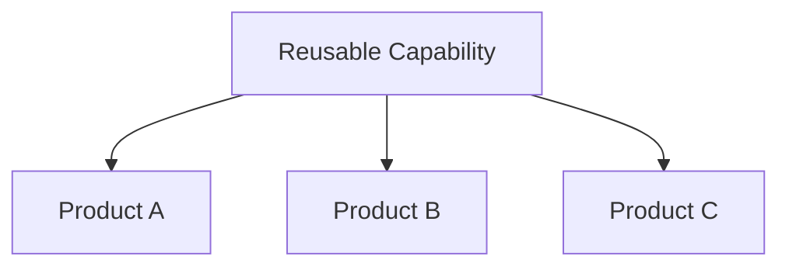

Examples of reusable capabilities include:

- eSIM onboarding
- MSISDN reservation
- Eligibility engine
- Product configuration
- Digital activation
- Add-on management
- Notification
- Usage visibility

This changes technology investment from:

> **Build integration for Product X**

toward:

> **Build reusable capability Y that enables Products X, Z and future propositions.**

---

# 19. Product Portfolio View

Individual products should not be considered in isolation.

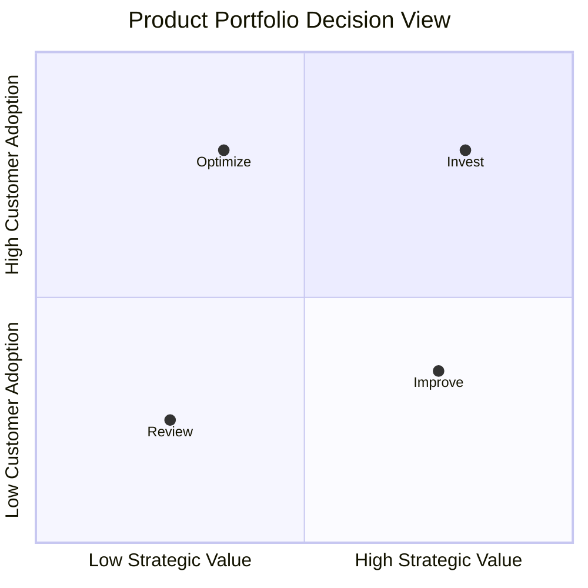

> The quadrant above is a conceptual decision framework, not measured product data.

Portfolio decisions may include:

- Invest
- Improve
- Simplify
- Bundle
- Reposition
- Retire

---

# 20. Product Retirement

A mature lifecycle also includes retirement.

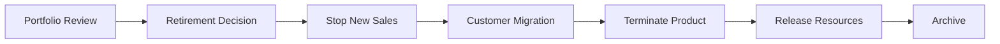

Retirement should consider both commercial and technical dependencies.

A product may disappear from the catalog while active customer instances continue to exist for a defined period.

---

# 21. Product Lifecycle and TM Forum APIs

The architecture can conceptually map lifecycle stages to relevant standardized capabilities.

```mermaid
flowchart LR

    DISCOVER["Discover"]

    DEFINE["Define"]

    CATALOG["Configure<br/>TMF620"]

    ORDER["Order<br/>TMF622"]

    PINV["Product Inventory<br/>TMF637"]

    SERVICE["Service<br/>TMF641 / TMF638"]

    RESOURCE["Resource<br/>TMF652 / TMF639"]

    ACT["Activate<br/>TMF702"]

    MEASURE["Measure"]

    IMPROVE["Improve"]

    DISCOVER --> DEFINE
    DEFINE --> CATALOG
    CATALOG --> ORDER
    ORDER --> PINV
    ORDER --> SERVICE
    SERVICE --> RESOURCE
    RESOURCE --> ACT
    ACT --> MEASURE
    MEASURE --> IMPROVE
    IMPROVE --> DEFINE
```

TM Forum APIs cover specific operational capabilities.

They do not replace the wider product-management lifecycle shown in this document.

---

# 22. Product and Technology Operating Model

Successful digital product delivery requires collaboration across several perspectives.

```mermaid
flowchart TB

    PRODUCT["Product Management"]

    COMMERCIAL["Commercial"]

    EXPERIENCE["Customer Experience"]

    ENGINEERING["Engineering"]

    ARCH["Architecture"]

    OPERATIONS["Operations"]

    DATA["Data & Analytics"]

    OUTCOME["Product Outcome"]

    PRODUCT --> OUTCOME
    COMMERCIAL --> OUTCOME
    EXPERIENCE --> OUTCOME
    ENGINEERING --> OUTCOME
    ARCH --> OUTCOME
    OPERATIONS --> OUTCOME
    DATA --> OUTCOME
```

The model intentionally avoids treating product management as an isolated business function.

Product success depends on coordinated commercial, experience, technology and operational execution.

---

# 23. Product-to-Activation Traceability

A product decision should ultimately be traceable through implementation and operational execution.

```mermaid
flowchart LR

    OPPORTUNITY["Opportunity"]

    INITIATIVE["Product Initiative"]

    OFFER["Product Offering"]

    ORDER["Product Order"]

    SERVICE["Service"]

    RESOURCE["Resources"]

    ACT["Activation"]

    KPI["Outcome"]

    OPPORTUNITY --> INITIATIVE
    INITIATIVE --> OFFER
    OFFER --> ORDER
    ORDER --> SERVICE
    SERVICE --> RESOURCE
    RESOURCE --> ACT
    ACT --> KPI

    KPI -. "feedback" .-> OPPORTUNITY
```

This creates a closed loop between **strategy and execution**.

---

# 24. North-Star Concept

The target operating model is:

```mermaid
flowchart LR

    IDEA["Idea"]

    CONFIG["Configure"]

    TEST["Validate"]

    LAUNCH["Launch"]

    ACTIVATE["Activate"]

    OBSERVE["Observe"]

    LEARN["Learn"]

    ITERATE["Iterate"]

    IDEA --> CONFIG
    CONFIG --> TEST
    TEST --> LAUNCH
    LAUNCH --> ACTIVATE
    ACTIVATE --> OBSERVE
    OBSERVE --> LEARN
    LEARN --> ITERATE
    ITERATE --> CONFIG
```

The architectural ambition is not simply faster development.

It is:

> **A reusable product engine where commercial ideas can be configured, launched, activated, measured and evolved without rebuilding the underlying technology journey for every proposition.**

---

# 25. Design Principles

1. **Start with customer and market value**
2. **Translate products into reusable capabilities**
3. **Separate commercial products from technical implementation**
4. **Treat platform readiness as part of product readiness**
5. **Treat subscriber resources as managed lifecycle entities**
6. **Design activation for failure and recovery**
7. **Make product outcomes measurable**
8. **Use standardized interfaces where applicable**
9. **Build capabilities once and reuse them across products**
10. **Close the loop between strategy, execution and data**

---

# 26. Relationship to the Reference Architecture

This lifecycle document describes **why and when** product capabilities are needed.

The solution architecture describes **how those capabilities interact technically**.

```mermaid
flowchart LR

    PRODUCT["Product Lifecycle<br/><br/>WHY / WHAT / WHEN"]

    ARCH["Reference Architecture<br/><br/>HOW"]

    EXEC["Activation<br/><br/>EXECUTION"]

    DATA["Measurement<br/><br/>FEEDBACK"]

    PRODUCT --> ARCH
    ARCH --> EXEC
    EXEC --> DATA
    DATA --> PRODUCT
```

---

## Related Documentation

- [Project Overview](../README.md)
- [Reference Architecture](architecture.md)
- [ADR-001 — Domain Separation](design-decisions/ADR-001-domain-separation.md)
- `esim-lifecycle.md`
- `msisdn-lifecycle.md`
- `tmf-api-mapping.md`
- `sid-domain-model.md`

---

## Standards Boundary

This is an independent reference architecture.

TM Forum Open APIs and ODA/SID concepts are referenced for architecture and interoperability purposes. Official TM Forum specifications remain authoritative.

Project-specific lifecycle models, diagrams, capability groupings and architectural abstractions are not presented as official TM Forum definitions.

---

## Author

**Mohamed Salman**

Solution & Enterprise Architecture · Digital Platforms · Telecommunications · Data & AI

---

**Digital Telco Product Activation Architecture**

*From market opportunity to activated and measurable subscriber.*
