# TM Forum Open API Mapping

> **Product → Service → Resource → Activation**  
> Architecture & Research by **Mohamed Salman**

---

## 1. Purpose

This document maps the Digital Telco Product Activation reference architecture to relevant **TM Forum Open APIs**.

The objective is not to redefine TM Forum interfaces.

The objective is to show how standardized capability boundaries can participate in an end-to-end digital product activation architecture covering:

```text
Product Definition
      ↓
Product Ordering
      ↓
Product Inventory
      ↓
Service Ordering
      ↓
Service Inventory
      ↓
Subscriber Resource Orchestration
      ↓
Resource Ordering
      ↓
Resource Inventory
      ↓
Resource Activation
```

The architecture deliberately distinguishes between:

**TM Forum standardized APIs**

and

**project-specific orchestration components and workflows.**

---

# 2. API Landscape

The primary APIs considered by this reference architecture are:

| API | Capability | Architecture Domain |
|---|---|---|
| **TMF620** | Product Catalog Management | Product |
| **TMF622** | Product Ordering Management | Product / Customer |
| **TMF637** | Product Inventory Management | Product |
| **TMF641** | Service Ordering Management | Service |
| **TMF638** | Service Inventory Management | Service |
| **TMF652** | Resource Order Management | Resource |
| **TMF639** | Resource Inventory Management | Resource |
| **TMF702** | Resource Activation Management | Resource / Activation |

These APIs provide standardized capability boundaries.

They do **not**, by themselves, prescribe the complete end-to-end orchestration implemented by this project.

---

# 3. Architectural Mapping

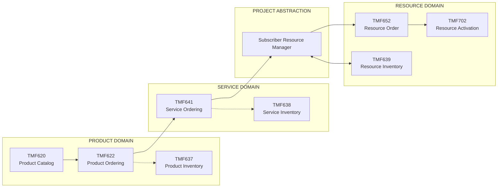

### Legend

**Solid arrows**

Represent the reference architecture's orchestration direction.

**Dashed arrows**

Represent lifecycle/inventory relationships rather than a claim that one TM Forum API directly invokes another.

---

# 4. Standards vs Reference Architecture

This distinction is fundamental.

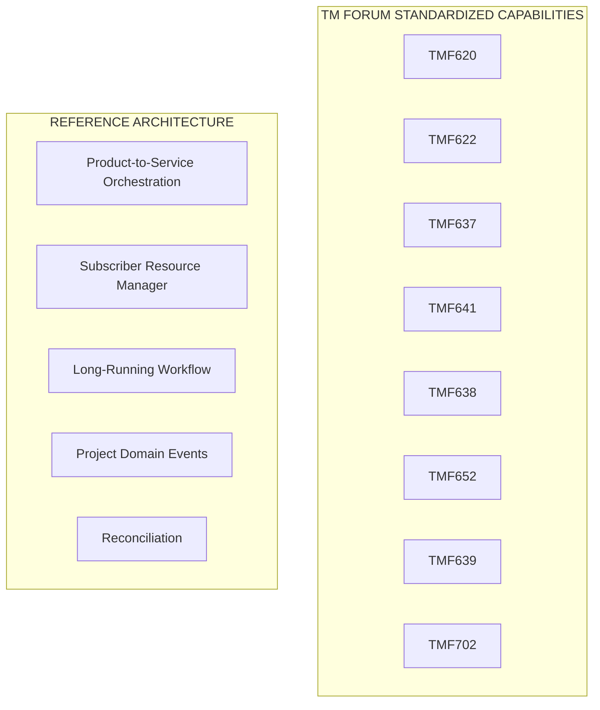

The components in the second group are architectural decisions made by this repository.

They are **not claimed to be TM Forum APIs or official ODA components**.

---

# 5. TMF620 — Product Catalog Management

## Role

TMF620 provides the standardized Product Catalog Management capability.

Within this architecture it represents the commercial definitions used to construct market-facing products and offerings.

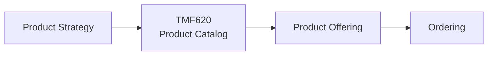

Typical architectural concerns include:

- Product catalog
- Product offering
- Product specification
- Catalog lifecycle
- Commercial definitions

### Architectural question

> **What can be sold?**

---

# 6. TMF622 — Product Ordering Management

## Role

TMF622 provides a standardized mechanism for product ordering.

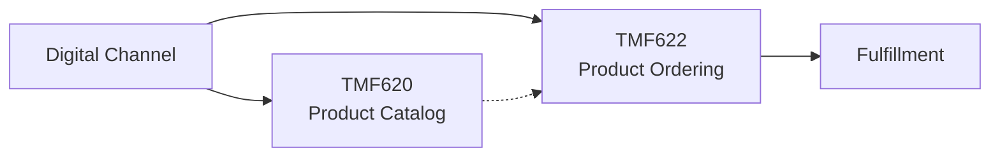

The product order represents **commercial intent**.

It should not contain network-specific provisioning logic.

### Architectural question

> **What has the customer requested to buy, change or terminate?**

---

# 7. TMF637 — Product Inventory Management

## Role

TMF637 provides standardized Product Inventory Management capabilities.

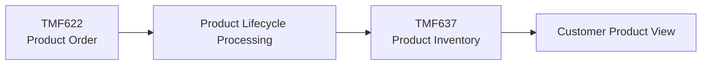

Product inventory represents instantiated customer products.

It is distinct from:

- Product Catalog
- Service Inventory
- Resource Inventory

### Architectural question

> **Which products does the customer currently have?**

---

# 8. Product Domain

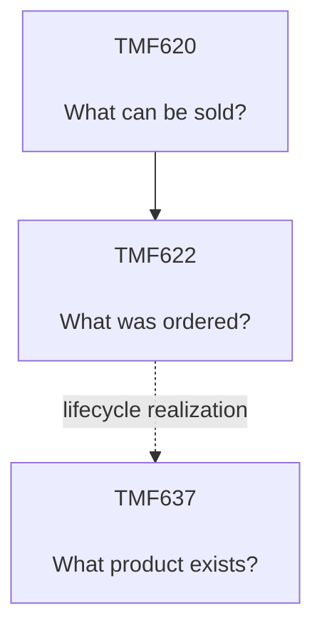

This forms the commercial side of the architecture.

---

# 9. TMF641 — Service Ordering Management

## Role

TMF641 provides standardized Service Ordering Management capabilities.

The service domain translates commercial intent into operational service intent.

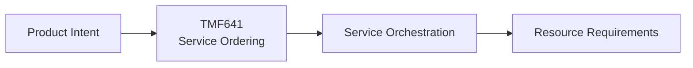

The service domain should not require the Product domain to understand resource-level implementation.

### Architectural question

> **What service must be created, changed or terminated?**

---

# 10. TMF638 — Service Inventory Management

## Role

TMF638 provides standardized capabilities to query and manipulate service inventory.

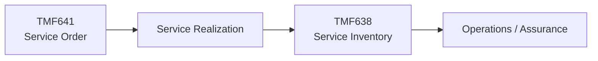

Service Inventory represents instantiated operational services.

### Architectural question

> **Which operational services currently exist?**

---

# 11. Service Domain

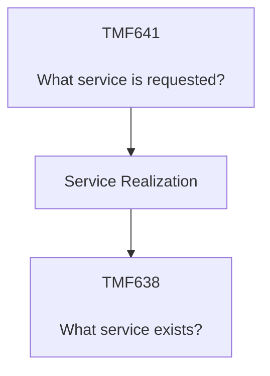

Again, the diagram represents this project's architectural flow rather than a requirement that TMF641 directly invokes TMF638.

---

# 12. Product-to-Service Boundary

One of the most important architecture boundaries is:

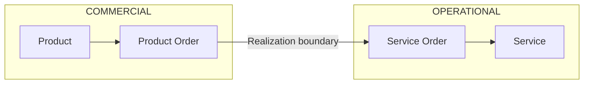

Conceptually:

```text
PRODUCT
What did the customer buy?

        ↓

SERVICE
What operational capability must exist?
```

The transformation between Product and Service is an orchestration/design concern.

It is not defined here as a new TM Forum API.

---

# 13. Subscriber Resource Manager

Between Service and Resource domains this reference architecture introduces:

> **Subscriber Resource Manager (SRM)**

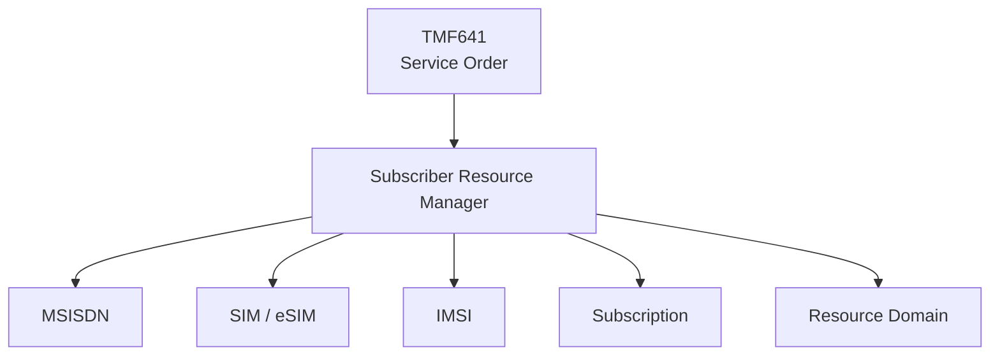

The SRM coordinates subscriber-specific resource relationships.

It is deliberately isolated from the TM Forum API labels.

> **SRM is a project-specific architectural abstraction. It is not presented as an official TM Forum API or ODA component.**

---

# 14. Why Introduce SRM?

Consider a service requiring:

```text
Subscription
     │
     ├── MSISDN
     ├── IMSI
     └── SIM / eSIM
```

These resources have different lifecycles.

For example:

```text
SIM replacement
       ≠
MSISDN replacement

MSISDN suspension
       ≠
Product termination

eSIM migration
       ≠
Product change
```

The SRM provides a logical boundary for coordinating these relationships without placing the complexity inside Product Order or Service Order.

---

# 15. TMF652 — Resource Order Management

## Role

TMF652 provides standardized Resource Order Management capabilities.

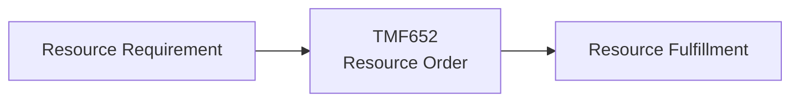

Within this architecture, Resource Order represents intent to create, modify or otherwise fulfill required technical resources.

### Architectural question

> **What resource operation is required?**

---

# 16. TMF639 — Resource Inventory Management

## Role

TMF639 provides standardized Resource Inventory Management capability.

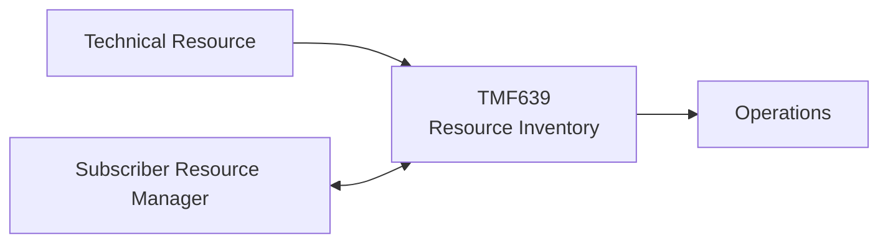

Resource inventory can represent technical resource instances and their relationships.

### Architectural question

> **Which technical resources exist and what is their state?**

---

# 17. TMF702 — Resource Activation Management

## Role

TMF702 represents Resource Activation Management.

Within this reference architecture it sits at the boundary between resource intent and technical execution.

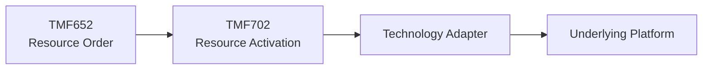

### Architectural question

> **How is the required resource capability activated?**

The exact downstream technology depends on the resource being activated.

---

# 18. Resource Domain

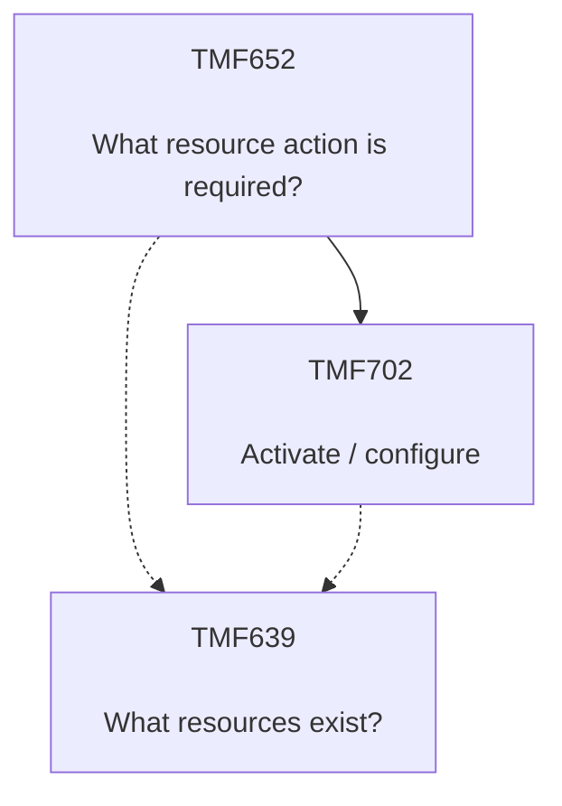

The dashed inventory relationships intentionally avoid claiming that TMF652 or TMF702 must directly update TMF639.

The actual synchronization pattern is an implementation decision.

---

# 19. Complete Product-to-Activation Map

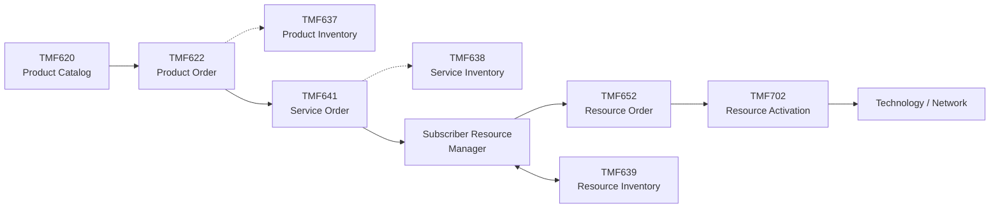

This is the core standards-aligned map of the repository.

---

# 20. End-to-End Example — Digital eSIM Product

Consider a customer purchasing a digital mobile product using eSIM.

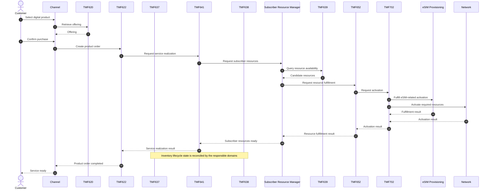

Important:

The sequence above is a **reference orchestration**.

It is not presented as a normative TM Forum call sequence.

---

# 21. API vs Orchestration

The architecture separates APIs from workflow logic.

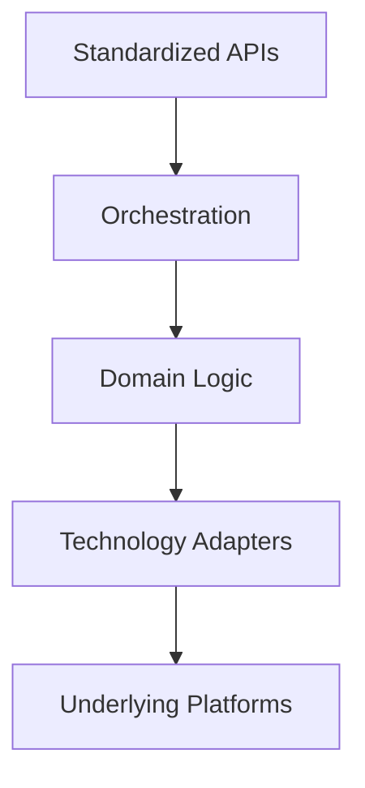

An API defines a capability boundary.

It does not necessarily define:

- Full business workflow
- Compensation strategy
- Retry policy
- Subscriber-resource relationship logic
- Technology-specific provisioning
- Cross-domain transaction coordination

Those remain architecture and implementation concerns.

---

# 22. Synchronous vs Event-Driven Interaction

Not every lifecycle interaction should be synchronous.

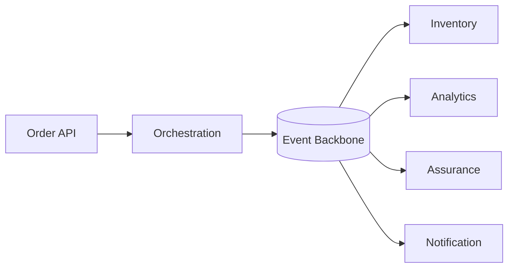

A useful design rule is:

> **Use APIs for capability invocation and queries; use events where lifecycle state changes need asynchronous propagation.**

The exact interaction pattern remains implementation-specific.

---

# 23. API Gateway

External consumers should interact through controlled API boundaries.

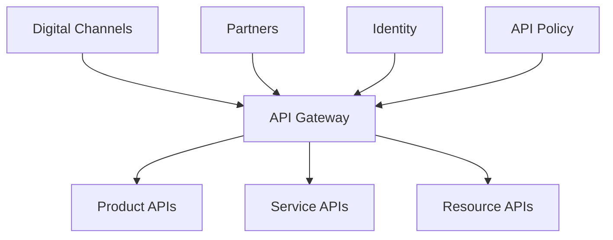

The gateway may handle:

- Authentication
- Authorization enforcement
- Routing
- Rate limiting
- API version routing
- Correlation identifiers
- Request validation
- API telemetry

The gateway should not become the domain orchestration engine.

---

# 24. API Version Independence

Different enterprise environments may operate different TM Forum API versions.

Therefore the architecture should avoid coupling business workflows to a specific wire-format implementation.

```mermaid
flowchart LR

    DOMAIN["Domain Capability"]

    CONTRACT["Canonical Boundary"]

    ADAPTER1["TMF API Version A"]

    ADAPTER2["TMF API Version B"]

    LEGACY["Legacy Adapter"]

    DOMAIN --> CONTRACT

    CONTRACT --> ADAPTER1
    CONTRACT --> ADAPTER2
    CONTRACT --> LEGACY
```

Whether such an internal canonical boundary is required depends on the target implementation.

It should not be introduced automatically if native standardized interfaces already satisfy the architecture.

---

# 25. Legacy Integration

A standards-aligned architecture does not require immediate replacement of existing systems.

```mermaid
flowchart LR

    TMF["TM Forum API Boundary"]

    ADAPTER["Anti-Corruption / Integration Layer"]

    LEGACY["Existing BSS / OSS"]

    TMF --> ADAPTER

    ADAPTER --> LEGACY
```

This allows modernization to occur incrementally.

The external capability contract can evolve independently from the underlying platform.

---

# 26. Traceability

A single customer transaction should remain traceable across domains.

```mermaid
flowchart LR

    PO["Product Order ID"]

    SO["Service Order ID"]

    SR["Subscriber Resource Context"]

    RO["Resource Order ID"]

    ACT["Activation ID"]

    TRACE["Correlation ID"]

    TRACE --> PO
    TRACE --> SO
    TRACE --> SR
    TRACE --> RO
    TRACE --> ACT
```

This becomes essential for:

- Customer support
- Order fallout analysis
- Reconciliation
- Operational troubleshooting
- SLA measurement
- Product analytics

---

# 27. Failure Boundary

An API failure does not always mean the business transaction failed.

```mermaid
flowchart TB

    REQUEST["Request"]

    TIMEOUT["Timeout"]

    QUERY["Query Current State"]

    STATE{"Operation Exists?"}

    SUCCESS["Continue"]

    RETRY["Safe Retry"]

    RECON["Reconciliation"]

    REQUEST --> TIMEOUT

    TIMEOUT --> QUERY

    QUERY --> STATE

    STATE -->|"Completed"| SUCCESS
    STATE -->|"Not Started"| RETRY
    STATE -->|"Unknown / Partial"| RECON
```

This is why idempotency and state reconciliation are important in long-running activation workflows.

---

# 28. API Ownership Model

```mermaid
flowchart TB

    PRODUCT["Product Domain"]

    SERVICE["Service Domain"]

    RESOURCE["Resource Domain"]

    PRODUCT --> PAPI["TMF620 / 622 / 637"]

    SERVICE --> SAPI["TMF641 / 638"]

    RESOURCE --> RAPI["TMF652 / 639 / 702"]
```

Domain ownership should remain explicit.

A domain owns its:

- Business capability
- Lifecycle rules
- API contract implementation
- State
- Events
- Operational telemetry

---

# 29. ODA Perspective

TM Forum Open Digital Architecture provides a broader component-based architecture model around these APIs.

The reference architecture therefore uses the APIs as **interoperability boundaries**, while keeping implementation-specific components replaceable.

```mermaid
flowchart LR

    EXPERIENCE["Experience"]

    PRODUCT["Product Capabilities"]

    SERVICE["Service Capabilities"]

    RESOURCE["Resource Capabilities"]

    TECHNOLOGY["Technology"]

    EXPERIENCE --> PRODUCT
    PRODUCT --> SERVICE
    SERVICE --> RESOURCE
    RESOURCE --> TECHNOLOGY
```

The repository does not claim that its project-specific component decomposition is itself an official ODA component map.

---

# 30. Architecture Rules

### Rule 1

**TMF API ≠ internal implementation**

A standardized API should not force all internal systems to use the same implementation model.

### Rule 2

**Product Order does not directly provision network resources**

Product intent crosses the Service and Resource boundaries.

### Rule 3

**Inventory APIs represent domain state**

Product, Service and Resource inventories should not be collapsed into one generic inventory abstraction.

### Rule 4

**SRM remains project-specific**

Subscriber Resource Manager must never be labeled as an official TM Forum component unless separately mapped to an actual standardized component.

### Rule 5

**API Gateway does not own orchestration**

Routing and API policy remain separate from domain workflow logic.

### Rule 6

**Standardize at boundaries**

Prefer standardized contracts where applicable while allowing implementation freedom behind them.

### Rule 7

**Do not invent normative call sequences**

A reference orchestration diagram must remain clearly distinguished from TM Forum normative behavior.

---

# 31. Standards Matrix

| Layer | Capability | Standard Boundary | Project Responsibility |
|---|---|---|---|
| Product | Catalog | TMF620 | Product configuration |
| Product | Ordering | TMF622 | Commercial workflow |
| Product | Inventory | TMF637 | Product lifecycle integration |
| Service | Ordering | TMF641 | Service realization |
| Service | Inventory | TMF638 | Service-state integration |
| Subscriber | SIM/eSIM/MSISDN coordination | Project abstraction | SRM |
| Resource | Ordering | TMF652 | Resource fulfillment |
| Resource | Inventory | TMF639 | Resource-state integration |
| Resource | Activation | TMF702 | Activation integration |
| Network | Technology-specific execution | Vendor/domain specific | Adapters |

This table is the central standards boundary for the repository.

---

# 32. Architectural North Star

```mermaid
flowchart LR

    IDEA["Product Idea"]

    TMF620["TMF620<br/>Define"]

    TMF622["TMF622<br/>Order"]

    TMF641["TMF641<br/>Realize Service"]

    SRM["Subscriber<br/>Resources"]

    TMF652["TMF652<br/>Order Resource"]

    TMF702["TMF702<br/>Activate"]

    OBS["Observe"]

    IDEA --> TMF620
    TMF620 --> TMF622
    TMF622 --> TMF641
    TMF641 --> SRM
    SRM --> TMF652
    TMF652 --> TMF702
    TMF702 --> OBS
```

The objective is:

> **Use standardized domain boundaries to reduce the architectural distance between a commercial product and an activated subscriber — without coupling product logic directly to network implementation.**

---

## Standards Boundary

This repository is an independent reference architecture.

TM Forum Open APIs and Open Digital Architecture concepts are referenced for architecture and interoperability purposes.

The diagrams in this document represent **project-level architectural mappings and example orchestration**, unless explicitly identified as behavior defined by TM Forum.

Official TM Forum specifications remain authoritative.

---

## Official References

- TMF620 — Product Catalog Management
- TMF622 — Product Ordering Management
- TMF637 — Product Inventory Management
- TMF641 — Service Ordering Management
- TMF638 — Service Inventory Management
- TMF639 — Resource Inventory Management
- TMF652 — Resource Order Management
- TMF702 — Resource Activation Management

Official API assets should be obtained from the TM Forum Open API directory.

---

## Related Documentation

- [Project Overview](../README.md)
- [Reference Architecture](architecture.md)
- [Product Lifecycle](product-lifecycle.md)
- [SIM & eSIM Lifecycle](esim-lifecycle.md)
- [MSISDN Lifecycle](msisdn-lifecycle.md)
- [ADR-001 — Domain Separation](design-decisions/ADR-001-domain-separation.md)

---

## Author

**Mohamed Salman**

Solution & Enterprise Architecture · Digital Platforms · Telecommunications · Data & AI

---

**Digital Telco Product Activation Architecture**

*Standards-aligned. Vendor-neutral. Product-to-activation.*
