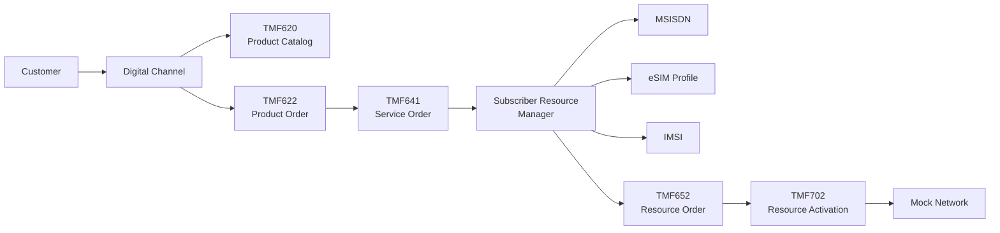
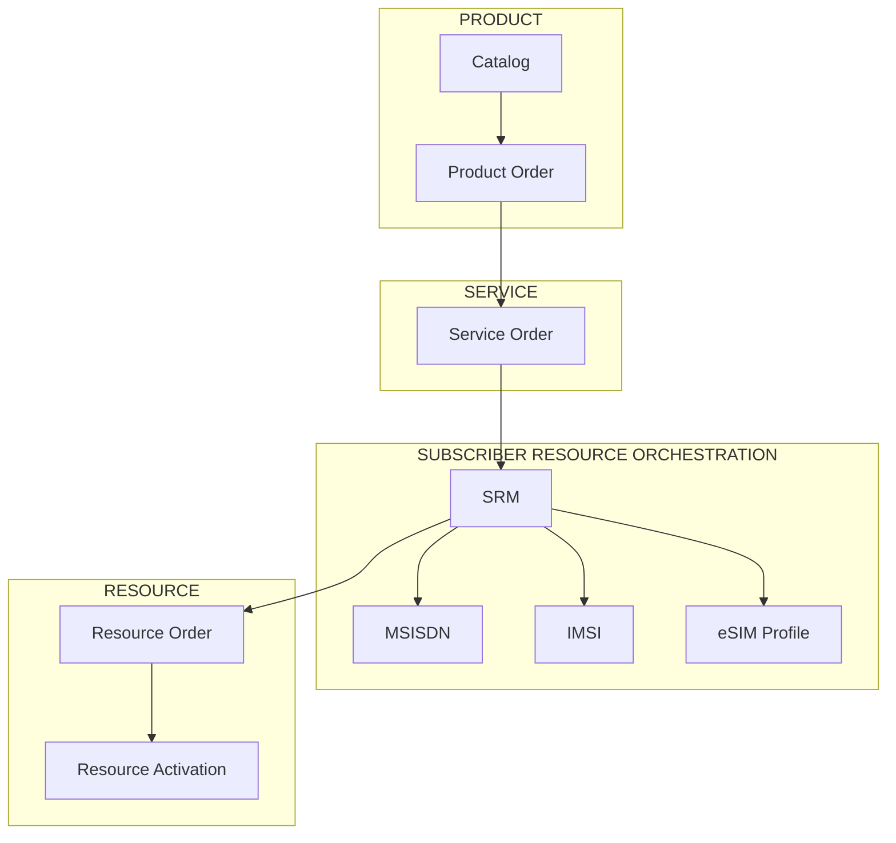
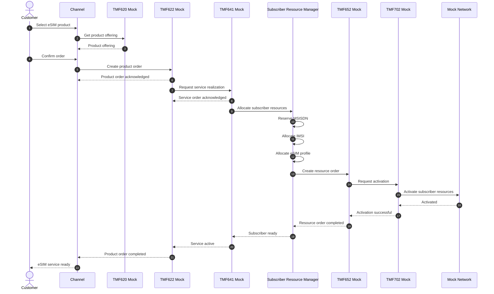
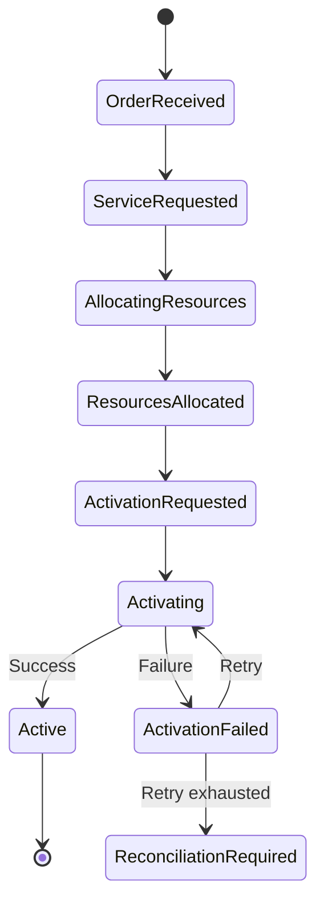
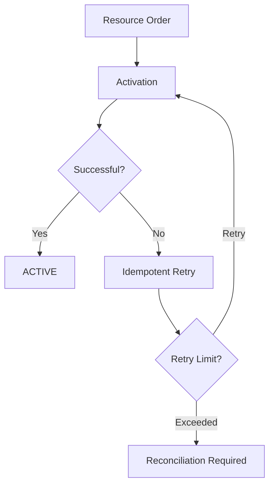
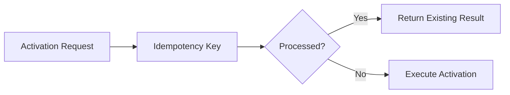
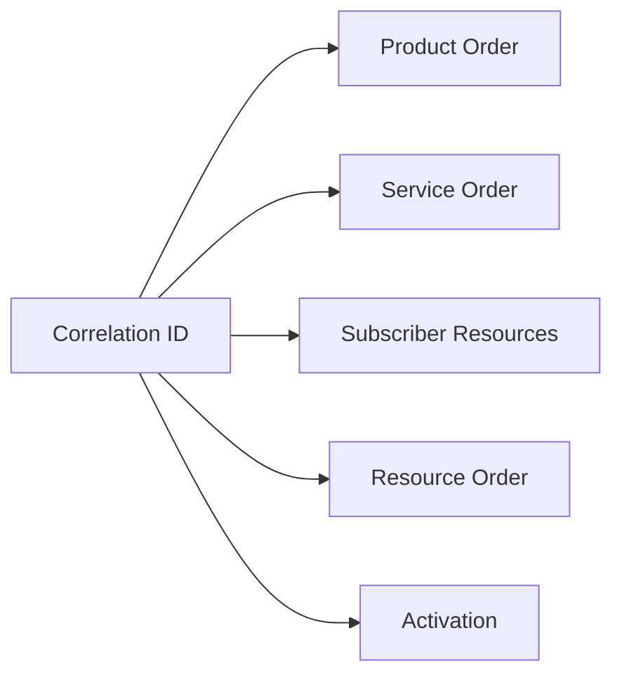

# Executable eSIM Onboarding Reference Flow

> **Product Order → Service Order → Subscriber Resources → Resource Order → Activation**

Architecture & Reference Implementation by **Mohamed Salman**

---

## What This Example Demonstrates

This example turns the repository architecture into an executable reference flow for digital eSIM onboarding.

The scenario demonstrates how a digital product can progress through separated Product, Service and Resource domains while keeping subscriber-resource orchestration isolated from channel and product logic.



---

## Scenario

A customer selects a mobile offer and requests activation using an eSIM.

The reference flow performs the following logical journey:

```text
1. Discover product offering
2. Create product order
3. Create service order
4. Request subscriber resources
5. Reserve MSISDN
6. Allocate IMSI
7. Allocate eSIM profile
8. Create resource order
9. Request resource activation
10. Verify activation
11. Complete service realization
12. Complete product order
```

---

## Domain Separation

The example intentionally separates four concerns:



The **Subscriber Resource Manager (SRM)** is a project-specific architectural component.

It is **not presented as an official TM Forum API or ODA component**.

---

## End-to-End Interaction



---

## Repository Structure

The completed example will follow this structure:

```text
examples/
└── esim-onboarding/
    │
    ├── README.md
    │
    ├── docker-compose.yml
    │
    ├── requirements.txt
    │
    ├── app.py
    │
    ├── orchestrator.py
    │
    ├── subscriber_resources.py
    │
    ├── activation.py
    │
    │
    ├── contracts/
    │   ├── product-order.json
    │   ├── service-order.json
    │   ├── resource-order.json
    │   └── activation-request.json
    │
    ├── openapi/
    │   └── subscriber-resource-api.yaml
    │
    └── events/
        ├── subscriber-resources-allocated.json
        └── subscriber-activated.json
```

The implementation is intentionally small.

The objective is not to recreate a production BSS/OSS stack.

The objective is to make the architecture **observable and executable**.

---

## Example Subscriber Context

The mock implementation will create a subscriber-resource context similar to:

```json
{
  "subscriptionId": "SUB-100001",
  "productOrderId": "PO-100001",
  "serviceOrderId": "SO-100001",
  "resourceOrderId": "RO-100001",
  "msisdn": "9665XXXX0001",
  "imsi": "42001XXXXXXXXX",
  "simType": "eSIM",
  "iccid": "89XXXXXXXXXXXXXXXXXX",
  "eid": "89XXXXXXXXXXXXXXXXXXXXXXXXXXXXXX",
  "status": "allocated"
}
```

All identifiers in this example are synthetic placeholders.

They do not represent real subscriber data.

---

## State Model



---

## Happy Path

```text
Product Order
      │
      ▼
Service Order
      │
      ▼
Subscriber Resource Manager
      │
      ├── Reserve MSISDN
      ├── Allocate IMSI
      └── Allocate eSIM Profile
      │
      ▼
Resource Order
      │
      ▼
Resource Activation
      │
      ▼
Mock Network
      │
      ▼
ACTIVE
```

---

## Failure Path

The example will also demonstrate activation failure.



This demonstrates an important distributed-systems principle:

> **A technical failure must not automatically create duplicate subscriber resources.**

---

## Idempotency

Each order will carry a stable transaction identifier.

Example:

```text
X-Correlation-ID: demo-100001
Idempotency-Key: activation-100001
```

A repeated activation request with the same idempotency key should return the existing result instead of provisioning another resource set.



---

## Observability

Every step should preserve a common correlation identifier.



Example log:

```text
[demo-100001] Product order created
[demo-100001] Service order created
[demo-100001] MSISDN reserved
[demo-100001] IMSI allocated
[demo-100001] eSIM profile allocated
[demo-100001] Resource order created
[demo-100001] Activation requested
[demo-100001] Subscriber activated
[demo-100001] Product order completed
```

---

## Domain Events

The implementation will emit simple project-level events such as:

```text
ProductOrderCreated
ServiceOrderCreated

MSISDNReserved
IMSIAllocated
ESIMProfileAllocated

SubscriberResourcesAllocated

ResourceOrderCreated

ActivationRequested
SubscriberActivated

ProductOrderCompleted
```

These event names belong to this reference implementation.

They are not claimed to be standardized TM Forum event definitions.

---

## Standards Alignment

The example references the following TM Forum capability boundaries:

| API | Role in Example |
|---|---|
| TMF620 | Product catalog |
| TMF622 | Product ordering |
| TMF641 | Service ordering |
| TMF652 | Resource ordering |
| TMF702 | Resource activation |

Additional inventory capabilities described elsewhere in the repository include:

| API | Capability |
|---|---|
| TMF637 | Product inventory |
| TMF638 | Service inventory |
| TMF639 | Resource inventory |

The implementation does not claim TM Forum conformance.

It demonstrates **standards-aligned architectural boundaries**.

---

## eSIM Boundary

The executable example does not attempt to implement GSMA remote SIM provisioning.

Instead:


A production implementation would integrate with the appropriate GSMA-compliant eSIM infrastructure.

The mock exists only to demonstrate the architectural boundary.

---

## Design Principles

The executable example follows these rules:

1. Product logic does not provision network resources directly.
2. Product, Service and Resource domains remain separated.
3. SIM/eSIM, IMSI and MSISDN remain distinct resources.
4. Resource allocation and activation remain separate operations.
5. Subscriber-resource orchestration remains outside the API gateway.
6. Activation requests are idempotent.
7. Failures are observable and reconcilable.
8. Every transaction carries a correlation identifier.
9. Technology-specific provisioning sits behind adapters.
10. TM Forum API names are not used to disguise project-specific APIs.

---

## What This Is Not

This example is not:

- A production BSS
- A production OSS
- A real SM-DP+ implementation
- A mobile-core implementation
- A complete TM Forum conformance implementation
- A replacement for official TM Forum specifications
- A replacement for GSMA eSIM specifications

It is an **executable architecture demonstrator**.

---

## Target Result

When the implementation is complete, the example should allow:

```bash
docker compose up --build
```

followed by a single request that triggers the entire simulated lifecycle:

```text
Product
   ↓
Order
   ↓
Service
   ↓
Subscriber Resources
   ↓
Resource Order
   ↓
Activation
   ↓
ACTIVE
```

The terminal output should expose each lifecycle transition with the same correlation ID.

---

## Architecture Goal

> **Make the distance between product intent and subscriber activation visible, standardized at the boundaries, and executable end-to-end.**

---

## Related Documentation

- [Main Architecture](../../docs/architecture.md)
- [Product Lifecycle](../../docs/product-lifecycle.md)
- [SIM & eSIM Lifecycle](../../docs/esim-lifecycle.md)
- [MSISDN Lifecycle](../../docs/msisdn-lifecycle.md)
- [TM Forum API Mapping](../../docs/tmf-api-mapping.md)

---

## Author

**Mohamed Salman**

Solution & Enterprise Architecture · Digital Platforms · Telecommunications · Data & AI

---

**Digital Telco Product Activation Architecture**

*Architecture you can run.*
